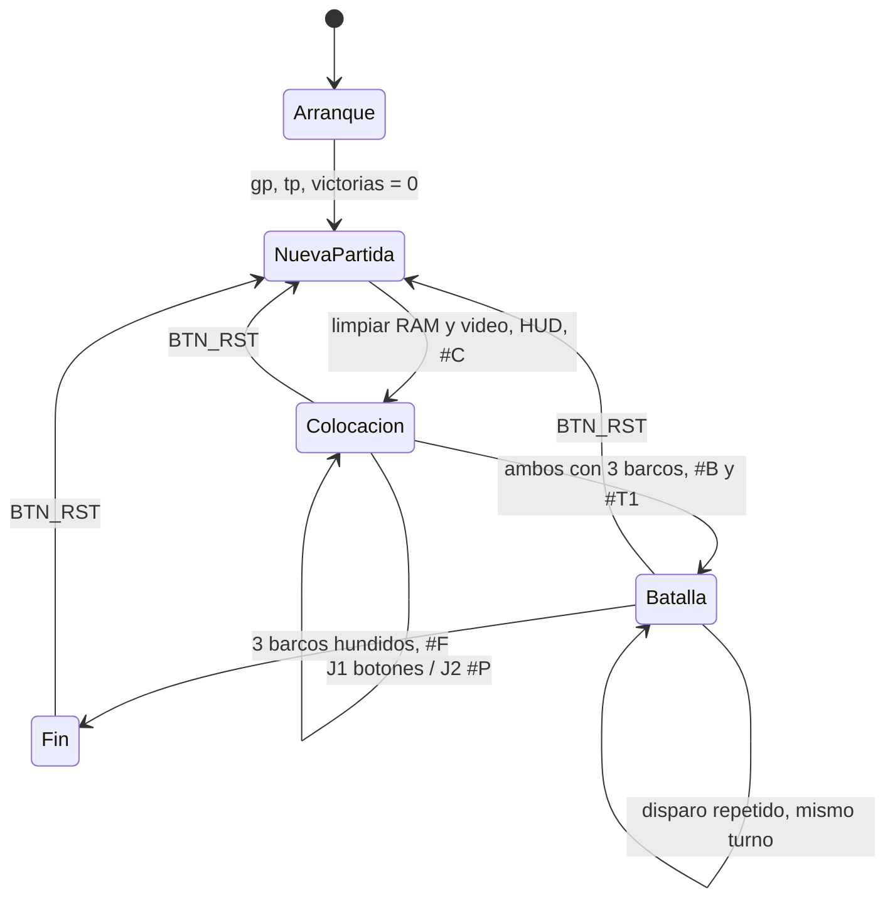
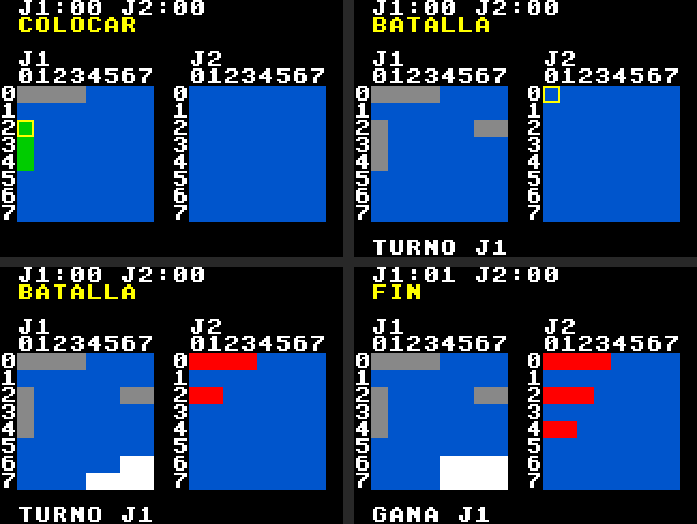

# Programa en ensamblador — Batalla Naval sobre RISC-V

## 1. Introducción

`ASSEMBLY/DESIGN/batalla_naval.s` contiene todo el control del juego: inicialización, colocación de barcos de ambos jugadores, turnos, disparos, barcos hundidos, victoria, resumen final y reinicio con `BTN_RST`. Los periféricos solo hacen entrada y salida, y la aplicación de PC es una terminal remota; ninguno de los dos contiene reglas del juego.

Tamaño: unas 970 instrucciones (3,8 KB de los 8 KB de la ROM).

## 2. Ensamblado

1. Abrir `batalla_naval.s` en RARS 1.6.
2. En *Settings → Memory Configuration*, elegir **Compact, Text at Address 0**. Esa configuración ubica el código en `0x0000_0000` y los datos en `0x0000_2000`, igual que el mapa de memoria del proyecto.
3. Ensamblar y usar *File → Dump Memory*: segmento `.text`, formato **Hexadecimal Text**, archivo `programa.mem`.
4. Copiar `programa.mem` a `FPGA/DESIGN/`. La ROM lo carga con `$readmemh`.

Desde la línea de comandos:

```
java -jar rars1_6.jar a nc mc CompactTextAtZero dump .text HexText programa.mem batalla_naval.s
```

El código de máquina que genera RARS es idéntico, palabra por palabra, al del ensamblador GNU (`riscv64-unknown-elf-as -march=rv32i`).

## 3. Convención de registros y llamadas

Se sigue la convención estándar de RISC-V [1, cap. 6] (planteamiento, sección 11):

| Registro | Uso |
|---|---|
| `gp` | Base de la RAM, `0x0000_2800`, fija |
| `tp` | Base de periféricos, `0x0001_0000`, fija |
| `sp` | Pila, empieza en `0x0000_2F00` y crece hacia abajo |
| `a0`–`a7` | Argumentos; el resultado vuelve en `a0` (y `a1`) |
| `t0`–`t6` | Temporales; no se conservan al llamar a otra rutina |
| `s0`–`s5` | Valores que deben sobrevivir a una llamada; quien los usa los guarda en la pila |
| `ra` | Retorno; lo guarda en la pila toda rutina que llama a otra |

**Carga de direcciones sin `lui`:** el procesador no implementa `lui` ni `auipc`, así que no se puede cargar una constante de más de 12 bits en una instrucción. Por eso `gp` y `tp` se cargan una vez al inicio con `addi` y `slli`, y todas las variables y registros se acceden con desplazamiento, por ejemplo `lw t0, TURNO(gp)` o `sw t0, LEDS(tp)`. Desde `gp = 0x2800` se alcanza toda la RAM, porque los desplazamientos de `lw`/`sw` van de −2048 a +2047.

**Pseudoinstrucciones usadas:** solo las que se traducen a instrucciones implementadas: `mv`, `j`, `ret`, `beqz`, `bnez`. No se usan `li` con valores grandes, `la` ni `call`. El simulador de instrucciones de `ASSEMBLY/SIMULATION` rechaza cualquier instrucción fuera de las 27 implementadas, y el programa completo pasa esa verificación.

## 4. Organización de la RAM

Una palabra por casilla (planteamiento, sección 8):

| Bits de la casilla | Significado |
|---|---|
| `[1:0]` | 0 agua, 1 barco 0 (4 casillas), 2 barco 1 (3), 3 barco 2 (2) |
| `[2]` | Casilla ya disparada |

| Dirección | Constante | Contenido |
|---|---|---|
| `0x2000` | `TAB_J1` | Tablero del J1 (64 palabras) |
| `0x2100` | `TAB_J2` | Tablero del J2 |
| `0x2200`–`0x2208` | `REST_J1` | Casillas restantes de cada barco del J1 |
| `0x220C` | `COLOC_J1` | Máscara de barcos colocados del J1 |
| `0x2210`–`0x221C` | `REST_J2`, `COLOC_J2` | Lo mismo para el J2 |
| `0x2220` | `FASE` | 0 colocación, 1 batalla, 2 fin |
| `0x2224` | `TURNO` | 0 J1, 1 J2 |
| `0x2228`, `0x222C` | `DISP_J1` | Disparos válidos de cada jugador |
| `0x2230`, `0x2234` | `HUND_J1` | Barcos hundidos por cada jugador |
| `0x2238` | `GANADOR` | |
| `0x2240`–`0x224C` | `CUR_*` | Cursor del J1: fila, columna, orientación, barco |
| `0x2250` | `ENT_ANT` | Lectura anterior de las entradas |
| `0x2280`–`0x229C` | `RX_*` | Receptor de tramas: contador, largo y campos |
| `0x2F00`, `0x2F04` | `VIC_J1`, `VIC_J2` | Victorias acumuladas (no se borran con `BTN_RST`) |

La vista que el J1 tiene del tablero rival se calcula desde el tablero del J2, mostrando solo las casillas disparadas. La posición de un barco no descubierto existe en un solo lugar y nunca se escribe en la memoria de video.

## 5. Flujo del programa



El lazo principal nunca se queda esperando a un jugador. En cada vuelta:

1. Lee las entradas y calcula las pulsaciones nuevas. Si `BTN_RST` se presionó, salta a nueva partida.
2. Si llegó un byte por UART, lo pasa al receptor de tramas. Si se completó una trama `#P` o `#D`, la atiende.
3. Según la fase: en colocación atiende los botones del J1; en batalla, solo en turno del J1, mueve su cursor y dispara con `BTN_OK`; en fin no hace nada.

**Colocación concurrente:** cada jugador avanza cuando llega su propia entrada, y el estado de colocación de cada uno se guarda por separado (`COLOC_J1`, `COLOC_J2`). La batalla empieza cuando las dos máscaras valen 7.

## 6. Rutinas

| Rutina | Entrada | Salida | Descripción |
|---|---|---|---|
| `leer_pulsaciones` | — | `a0` pulsaciones | Botones: paso de 0 a 1; `BTN_SEL` (switch): cualquier cambio |
| `atender_j1_colocacion` | `a0` pulsaciones | — | Cursor, rotación, confirmación; sonido si la colocación no es válida |
| `atender_colocacion_j2` | trama en `RX_BUF` | — | Valida y responde `#A b` o `#X b motivo` |
| `validar_colocacion` | `a0` jugador, `a1` barco, `a2` fila, `a3` columna, `a4` orientación | `a0`: 0 válida, 1 fuera, 2 traslape, 3 ya colocado | Revisa límites y casillas ocupadas |
| `colocar_barco` | igual | — | Escribe el barco y marca la máscara |
| `celda_dir` | `a0` jugador, `a1` fila, `a2` columna | `a0` dirección | `0x2000 + j·256 + (f·8 + c)·4` |
| `iniciar_batalla` | — | — | Fase 1, turno J1, HUD, LED, `#B` y `#T1` |
| `atender_j1_batalla` | `a0` pulsaciones | — | Cursor sobre el tablero rival y disparo con `BTN_OK` |
| `atender_disparo_j2` | trama en `RX_BUF` | — | Solo en batalla y en turno del J2; `#N` si la casilla se repite |
| `procesar_disparo` | `a0` tirador, `a1` fila, `a2` columna | `a0`: 0 repetido, 1 fallo, 2 impacto, 3 hundido | Marca la casilla, cuenta disparos, descuenta casillas y cuenta hundidos |
| `resultado_disparo` | `a0` tirador, `a1` fila, `a2` columna, `a3` resultado | — | Sonido, `#R` o `#E`, pantalla; victoria o cambio de turno con `#T` |
| `fin_partida` | `a0` ganador | — | Victorias (máximo 99), LED, sonido, HUD y `#F` |
| `uart_recibir` | — | `a0`: 0 nada, 1 `#P`, 2 `#D` | Receptor de tramas; descarta lo que no calza |
| `enviar_car`, `enviar_trama`, `enviar_decimal` | byte o campos | — | Transmisión por UART |
| `a_decimal` | `a0` número | `a0` decenas, `a1` unidades | Restas sucesivas de 10 (no hay división) |
| `dibujar_tablero_j1`, `dibujar_tablero_j2` | — | — | Redibujan los tableros; el J1 con vista previa, el rival sin barcos ocultos |
| `simbolo`, `limpiar_tiles`, `tile_dir` | — | — | Escritura en la memoria de video |
| `dibujar_hud_fijo`, `texto_fase`, `texto_mensaje`, `mostrar_victorias` | — | — | HUD y displays |

## 7. Receptor de tramas y datos inválidos

`uart_recibir` arma las tramas con un contador de caracteres:

1. Mientras no hay trama en curso, todo byte distinto de `#` se descarta.
2. Tras `#`, la letra fija el largo (`P` → 6, `D` → 4). Cualquier otra letra descarta la trama.
3. Cada campo se revisa contra su rango: barco 0–2, fila y columna 0–7, orientación `H`/`V`. Si uno no calza, se descarta la trama completa.
4. Un `#` a mitad de trama empieza una trama nueva.
5. Una trama válida que no corresponde a la fase o al turno se descarta.

Una trama descartada nunca modifica los tableros, el turno ni el estado de colocación.

## 8. Tiempo de respuesta del lazo principal

El receptor del UART guarda un solo byte, así que el lazo principal debe leerlo antes de que llegue el siguiente: 4340 ciclos a 50 MHz.

Se midió en el simulador de instrucciones, durante partidas completas, el mayor intervalo entre dos lecturas del UART sin transmisión en curso:

| Versión | Peor intervalo | Margen a 50 MHz | ¿Funciona a 25 MHz (2170 ciclos)? |
|---|---|---|---|
| Primera (el redibujado calculaba cada dirección) | 2790 ciclos | 1,6 veces | No |
| Actual (redibujado con punteros) | 1276 ciclos | 3,4 veces | Sí |

## 9. Validación

| Prueba | Qué revisa | Resultado |
|---|---|---|
| `ASSEMBLY/SIMULATION/prueba_juego.py` | Dos partidas completas sobre el simulador de instrucciones, que además rechaza instrucciones o direcciones fuera del proyecto (detalle abajo) | PASS, 54 verificaciones |
| `FPGA/SIMULATION/tb_sistema_juego.sv` | El mismo programa en el RTL completo, con los divisores reales del UART: colocación, inicio de batalla y un disparo de cada jugador | PASS, 20 verificaciones (Icarus Verilog) |

Qué revisa `prueba_juego.py`:

- colocación concurrente;
- los tres motivos de rechazo;
- basura y tramas incompletas;
- `#D` fuera de turno;
- disparos repetidos de ambos jugadores;
- privacidad en VGA;
- hundidos, victoria de cada jugador y resumen `#F`;
- `BTN_RST` conservando las victorias;
- que no se pierda ningún byte de RX.

El simulador de instrucciones (`iss.py`) ejecuta el mismo `programa.mem` que carga la ROM, un ciclo por instrucción. Modela los periféricos en sus direcciones, con la duración real de cada byte UART.

`pantalla.py` dibuja la pantalla a partir de la memoria de video simulada, con la misma paleta y los mismos símbolos del hardware. Uso:

```
cd ASSEMBLY/SIMULATION
python3 prueba_juego.py ../../FPGA/DESIGN/programa.mem [carpeta_para_imagenes]
python3 medir_uart.py ../../FPGA/DESIGN/programa.mem 8ec
```



**Figura 1.** Pantalla generada a partir de la memoria de video del simulador de instrucciones durante `prueba_juego.py`: colocación con vista previa y cursor, inicio de la batalla (los barcos del J2 no se muestran), batalla avanzada y fin de partida.

> Las imágenes y resultados del simulador de instrucciones son del programa, no de la tarjeta. El funcionamiento en la FPGA debe comprobarse y documentarse aparte.

## Referencias

[1] D. Harris y S. Harris. *Digital Design and Computer Architecture. RISC-V Edition*. Morgan Kaufmann, 2022.
