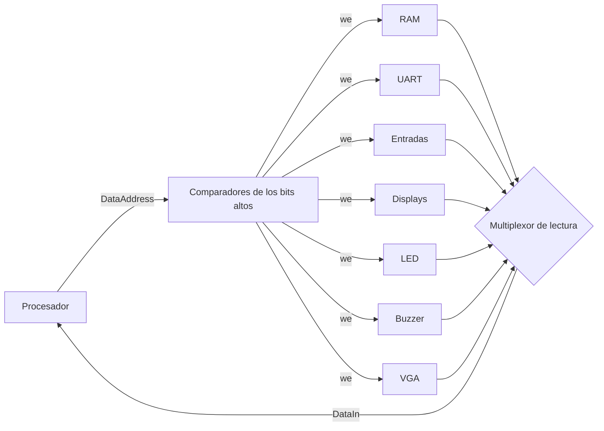

# Memorias, bus de datos y relojes — Batalla Naval sobre RISC-V

## 1. Introducción

Este bloque conecta el procesador con todo lo demás. Tiene tres partes:

| Módulo | Función |
|---|---|
| `rom` | Memoria de programa, 8 KB |
| `ram` | Memoria de datos, 4 KB |
| `data_bus` | Decodificador de direcciones y multiplexor de lectura del bus de datos |
| `clk_gen` | PLL: reloj del sistema (50 MHz) y de píxel (25 MHz), y reinicios |
| `reset_sync` | Reinicio sincronizado a cada dominio de reloj |

El procesador tiene dos buses independientes, como pide el enunciado. El bus de programa va directo a la ROM. Por el bus de datos pasan todos los demás accesos, y el decodificador los dirige a la RAM o al periférico que corresponda. Así el programa maneja todo con `lw` y `sw`, sin instrucciones especiales de entrada y salida [1, cap. 9].

## 2. Mapa de memoria

| Región | Rango | Palabras | Módulo |
|---|---|---|---|
| ROM | `0x0000_0000–0x0000_1FFF` | 2048 | `rom` (solo bus de programa) |
| RAM | `0x0000_2000–0x0000_2FFF` | 1024 | `ram` |
| UART | `0x0001_0040–0x0001_004F` | 4 registros | `uart_peripheral` |
| Entradas J1 | `0x0001_0120–0x0001_012F` | 4 registros | `input_peripheral` |
| Displays | `0x0001_0130–0x0001_0137` | 2 registros | `seg_peripheral` |
| LED | `0x0001_0138–0x0001_013F` | 2 registros | `led_peripheral` |
| Buzzer | `0x0001_0140–0x0001_014F` | 4 registros | `buzzer_peripheral` |
| Video | `0x0001_1000–0x0001_17FF` | 512 | `vga_peripheral` |

## 3. `rom` y `ram`

Ambas se leen de forma **combinacional**. En un procesador uniciclo la instrucción y el dato de `lw` tienen que estar listos en el mismo ciclo en que se presenta la dirección [1, cap. 7]. Por eso no se usan bloques RAM con lectura registrada, sino memoria distribuida (LUTs), de la que la Nexys 4 tiene de sobra.

| Módulo | Entradas | Salidas | Detalle |
|---|---|---|---|
| `rom` | `addr_i[31:0]` | `data_o[31:0]` | Usa `addr_i[12:2]`. Se carga al sintetizar con `$readmemh(INIT_FILE)`; las posiciones que el archivo no cubre quedan como `nop` |
| `ram` | `clk_i`, `we_i`, `addr_i[9:0]`, `wdata_i[31:0]` | `rdata_o[31:0]` | Escritura en el flanco de subida; arranca en cero |

El parámetro `INIT_FILE` de la ROM es `programa.mem`, generado por RARS a partir de `ASSEMBLY/DESIGN/batalla_naval.s`.

## 4. `data_bus`

| Destino | Condición | Dirección interna |
|---|---|---|
| RAM | `addr[31:12] = 0x00002` | `addr[11:2]` |
| UART | `addr[31:4] = 0x0001004` | `addr[3:2]` |
| Entradas | `addr[31:4] = 0x0001012` | `addr[3:2]` |
| Displays | `addr[31:3] = 0x00002026` | `{0, addr[2]}` |
| LED | `addr[31:3] = 0x00002027` | `{0, addr[2]}` |
| Buzzer | `addr[31:4] = 0x0001014` | `addr[3:2]` |
| Video | `addr[31:11] = 0x000022` | `addr[10:2]` (9 bits) |

- **Displays y LED en bloques de 8 bytes:** el enunciado pone el LED en `0x138`, que cae dentro del bloque de 16 bytes que empieza en `0x130`. Por eso esos dos periféricos se separan en bloques de 8 bytes y solo el bit 2 elige el registro. Ambos siguen usando `addr_i[1:0]` de la interfaz estándar.
- **Un solo destino por acceso:** solo el destino seleccionado recibe `we`.
- **Direcciones sin asignar:** una dirección fuera de todas las regiones lee 0 y una escritura ahí no tiene efecto.

## 5. `clk_gen` y `reset_sync`

La Nexys 4 tiene un único reloj de 100 MHz. Un PLL del Artix-7 (primitiva `PLLE2_BASE`, sin IP generada) produce los dos relojes:

| Parámetro | Valor | Resultado |
|---|---|---|
| `CLKFBOUT_MULT` / `DIVCLK_DIVIDE` | 10 / 1 | VCO = 1000 MHz (rango válido: 800–1600 MHz) |
| `CLKOUT0_DIVIDE` (`SYS_DIVIDE`) | 20 | `clk_sys` = 50 MHz |
| `CLKOUT1_DIVIDE` (`PIX_DIVIDE`) | 40 | `clk_pix` = 25 MHz |

Si el sistema no cerrara timing a 50 MHz, basta con poner `SYS_DIVIDE = 40` (25 MHz) y recalcular los divisores del UART y del tick. El programa sigue funcionando a esa frecuencia: el peor intervalo entre lecturas del UART es de 1276 ciclos, frente a los 2170 que dura un byte a 25 MHz (ver la documentación del ensamblador).

**Reinicio.** El reinicio general está activo mientras el PLL no está enclavado (`LOCKED = 0`). `LOCKED` es asíncrono respecto a los relojes de salida, así que cada dominio lo recibe a través de `reset_sync`: dos flip-flops en serie que arrancan en 1. El reinicio resultante es síncrono y activo en alto, y solo ocurre al programar o encender la tarjeta. `BTN_RST` no reinicia el hardware: lo atiende el programa, para conservar las victorias acumuladas.

## 6. Validación

| Testbench | Qué revisa | Resultado |
|---|---|---|
| `tb_cpu_bus.sv` | Procesador, ROM, RAM y decodificador reales ejecutando `programas/tb_bus.s`. Escribe y lee en cada región con marcas distintas por periférico; revisa las firmas en RAM y la cantidad de escrituras que recibió cada destino | PASS, 24 verificaciones (Icarus Verilog) |

Casos cubiertos:

- primera y última palabra de la RAM y de la memoria de video;
- los tres registros del UART;
- que el LED (`0x138`, `0x13C`) no escriba en los displays;
- que `0x1_0100`, `0x3000` y `0x1_1800` lean 0 y no lleguen a ningún destino.

`clk_gen` se revisó con el linter (Verilator). Solo se puede simular en Vivado, porque usa primitivas de la biblioteca UNISIM.

> Estos resultados se obtuvieron con Icarus Verilog durante el desarrollo. Deben repetirse en Vivado antes de incluirse como evidencia final.

## Referencias

[1] D. Harris y S. Harris. *Digital Design and Computer Architecture. RISC-V Edition*. Morgan Kaufmann, 2022.
