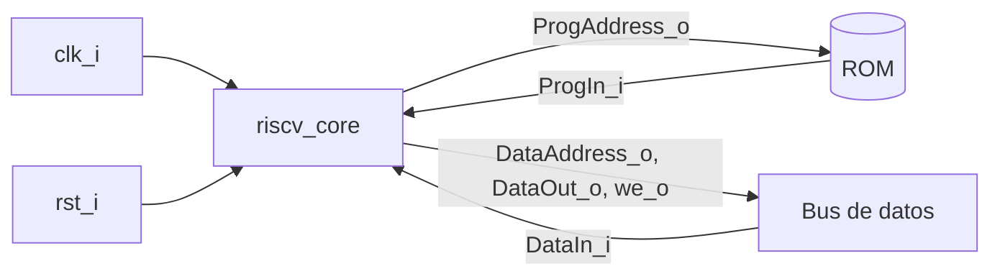
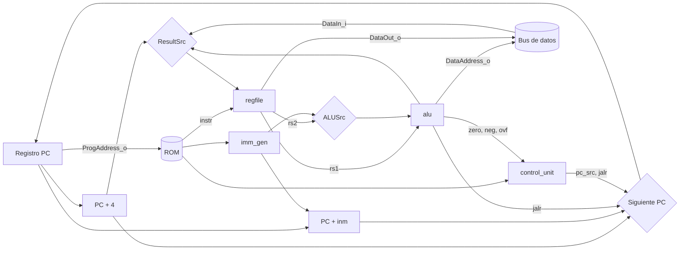

# Procesador RV32I uniciclo — Batalla Naval sobre RISC-V

## 1. Introducción

Este documento describe el microprocesador de 32 bits que ejecuta el programa del juego. Implementa el subconjunto de RV32I que pide el enunciado y sigue la microarquitectura uniciclo de Harris y Harris [1, cap. 7]: cada instrucción se completa en un solo ciclo de reloj.

Se eligió uniciclo porque es la organización más simple de implementar, depurar y explicar, y su rendimiento sobra para un juego por turnos. Multiciclo exigía una máquina de estados de control más grande, y pipeline agregaba riesgos de datos y de control sin ningún beneficio para la aplicación.

El procesador está formado por ocho módulos:

| Módulo | Función |
|---|---|
| `riscv_core` | Tope del procesador, con la interfaz del enunciado |
| `datapath` | PC, sumadores, multiplexores y conexión de los bloques |
| `control_unit` | Une los decodificadores y decide los saltos |
| `main_decoder` | Señales de control según el `opcode` |
| `alu_decoder` | Operación de la ALU según `funct3` y el bit 30 |
| `alu` | Operaciones aritméticas, lógicas, de comparación y desplazamiento |
| `regfile` | 32 registros de 32 bits |
| `imm_gen` | Inmediatos de los formatos I, S, B y J |

## 2. Primer nivel

### Objetivo

Ejecutar el programa en ensamblador almacenado en la ROM, accediendo a la RAM y a los periféricos por un bus de datos independiente del bus de programa.

### Entradas y salidas

| Señal | Dirección | Ancho | Descripción |
|---|---|---|---|
| `clk_i` | Entrada | 1 | Reloj del sistema (50 MHz) |
| `rst_i` | Entrada | 1 | Reinicio síncrono, activo en alto; lleva el PC a `0x0000_0000` |
| `ProgAddress_o` | Salida | 32 | Dirección de la instrucción (PC) |
| `ProgIn_i` | Entrada | 32 | Instrucción leída de la ROM |
| `DataAddress_o` | Salida | 32 | Dirección del acceso de datos (resultado de la ALU) |
| `DataOut_o` | Salida | 32 | Dato a escribir (`rs2`) |
| `DataIn_i` | Entrada | 32 | Dato leído de la RAM o de un periférico |
| `we_o` | Salida | 1 | 1 durante un `sw` (nunca durante el reinicio) |

Al ser uniciclo, `ProgIn_i` y `DataIn_i` deben llegar en el mismo ciclo en que se presenta la dirección. Por eso la ROM, la RAM y los registros de los periféricos se leen de forma combinacional (ver `MEMORIA_BUS_DOCUMENTATION.md`).

## 3. Segundo nivel: datapath y control

- **Datapath:** guarda el PC y calcula `PC + 4` y `PC + inmediato`. Lee dos registros, prepara el segundo operando (registro o inmediato), opera en la ALU y escribe en el registro destino uno de tres valores: el resultado de la ALU, el dato leído o `PC + 4`.
- **Unidad de control:** a partir de la instrucción genera las señales que eligen cada camino del datapath. También decide si un salto condicional se toma, usando las banderas de la resta.

## 4. Tercer nivel: módulos

### 4.1. `alu`

| Código `alu_ctrl_i` | Operación | Usada por |
|---|---|---|
| `0000` | suma | `add`, `addi`, `lw`, `sw`, `jalr` |
| `0001` | resta | `sub`, saltos condicionales |
| `0010` | and | `and`, `andi` |
| `0011` | or | `or`, `ori` |
| `0100` | xor | `xor`, `xori` |
| `0101` | menor con signo | `slt`, `slti` |
| `0110` | menor sin signo | `sltu`, `sltiu` |
| `0111` | desplazamiento a la izquierda | `sll`, `slli` |
| `1000` | desplazamiento lógico a la derecha | `srl`, `srli` |
| `1001` | desplazamiento aritmético a la derecha | `sra`, `srai` |

Las banderas `zero_o`, `neg_o` y `ovf_o` salen siempre de la resta `a − b`, sin importar la operación elegida. La resta se hace con un bit extra: el bit 32 es el préstamo y vale 1 exactamente cuando `a < b` sin signo, lo que da `sltu`.

Para la comparación con signo se usa `neg ⊕ ovf` y no solo el bit de signo [1, cap. 5]. Por ejemplo, en `0x8000_0000 − 1` la resta se desborda y el bit de signo sale 0, aunque el número más negativo sí es menor que 1. Este caso está en el plan de pruebas.

La cantidad de desplazamiento son los 5 bits bajos del segundo operando, como define RV32I.

### 4.2. `regfile`

Dos lecturas combinacionales (`rs1`, `rs2`) y una escritura en el flanco de subida. El registro `x0` se lee siempre como 0 y nunca se escribe. No tiene reinicio: el programa carga cada registro antes de usarlo, y así Vivado puede implementarlo como RAM distribuida en lugar de 1024 flip-flops.

### 4.3. `imm_gen`

| `imm_src_i` | Formato | Instrucciones | Inmediato |
|---|---|---|---|
| `00` | I | aritméticas inmediatas, `lw`, `jalr` | `instr[31:20]` con signo |
| `01` | S | `sw` | `{instr[31:25], instr[11:7]}` con signo |
| `10` | B | `beq`, `bne`, `blt`, `bge` | `{instr[31], instr[7], instr[30:25], instr[11:8], 0}` |
| `11` | J | `jal` | `{instr[31], instr[19:12], instr[20], instr[30:21], 0}` |

### 4.4. `main_decoder`

| Instrucciones | `opcode` | RegWrite | ImmSrc | ALUSrc | MemWrite | ResultSrc | Branch | Jump | ALUOp |
|---|---|---|---|---|---|---|---|---|---|
| Tipo R | `0110011` | 1 | — | registro | 0 | ALU | 0 | 0 | `10` |
| Tipo I aritméticas | `0010011` | 1 | I | inmediato | 0 | ALU | 0 | 0 | `10` |
| `lw` | `0000011` | 1 | I | inmediato | 0 | dato leído | 0 | 0 | `00` |
| `sw` | `0100011` | 0 | S | inmediato | 1 | — | 0 | 0 | `00` |
| Saltos condicionales | `1100011` | 0 | B | registro | 0 | — | 1 | 0 | `01` |
| `jal` | `1101111` | 1 | J | — | 0 | PC + 4 | 0 | 1 | — |
| `jalr` | `1100111` | 1 | I | inmediato | 0 | PC + 4 | 0 | 1 | `00` |

Un `opcode` que no pertenece al subconjunto deja todas las señales en 0: la instrucción no escribe nada y el PC avanza a `PC + 4`.

### 4.5. `alu_decoder`

Con `ALUOp = 00` la ALU suma y con `01` resta. Con `10` la operación sale de `funct3`. El bit 30 de la instrucción distingue `sub` de `add` y `sra`/`srai` de `srl`/`srli`. En `addi` ese bit forma parte del inmediato, por eso `sub` solo se elige si además la instrucción es tipo R (`opcode[5] = 1`).

### 4.6. `control_unit`: saltos

| `funct3` | Instrucción | Salta si |
|---|---|---|
| `000` | `beq` | `zero` |
| `001` | `bne` | no `zero` |
| `100` | `blt` | `neg ⊕ ovf` |
| `101` | `bge` | no (`neg ⊕ ovf`) |

`bltu` y `bgeu` no forman parte del subconjunto y nunca saltan.

### 4.7. `datapath`: siguiente PC

| Condición | Siguiente PC |
|---|---|
| `jalr` | `(rs1 + inm)` con el bit 0 en cero |
| salto tomado o `jal` | `PC + inm` |
| cualquier otro caso | `PC + 4` |

## 5. Instrucciones implementadas

`lw`, `sw`, `sll`, `slli`, `srl`, `srli`, `sra`, `srai`, `add`, `and`, `xor`, `or`, `sub`, `addi`, `andi`, `xori`, `ori`, `beq`, `bne`, `blt`, `bge`, `slt`, `slti`, `sltu`, `sltiu`, `jal`, `jalr`.

El enunciado escribe `sltui`; es una errata y la instrucción de RV32I es `sltiu` (*set less than immediate unsigned*).

No se implementan `lui` ni `auipc`. El programa carga las direcciones grandes con registros base (`gp` y `tp`), como se explica en la documentación del ensamblador.

## 6. Validación

| Testbench | Qué revisa | Resultado |
|---|---|---|
| `tb_alu.sv` | Cada operación contra un modelo de referencia: 64 combinaciones de casos de borde (0, 1, −1, máximos, mínimos, 31, 32) y 2000 pares aleatorios por operación; banderas de la resta | PASS, 20 640 comparaciones (Icarus Verilog) |
| `tb_riscv_core.sv` | Ejecuta `programas/tb_cpu.s` y compara 46 resultados guardados en RAM | PASS, 46 pruebas (Icarus Verilog) |

Casos de borde de `tb_riscv_core`: escritura a `x0`, desplazamientos de 0 y de 31, cantidad de desplazamiento mayor a 31, `slt` frente a `sltu` con negativos, comparaciones y saltos donde la resta desborda (`0x8000_0000` frente a 1), salto hacia atrás en un lazo, enlace de `jal`, llamada y retorno con `jalr`, y `jalr` con destino impar.

Para comprobar que el testbench detecta errores, se modificó a propósito la lógica de `blt` para usar solo el bit de signo. El testbench marcó FAIL exactamente en las dos pruebas de desborde.

> Estos resultados se obtuvieron con Icarus Verilog durante el desarrollo. Deben repetirse en Vivado y guardarse las capturas antes de incluirlos como evidencia final.

## Referencias

[1] D. Harris y S. Harris. *Digital Design and Computer Architecture. RISC-V Edition*. Morgan Kaufmann, 2022.
