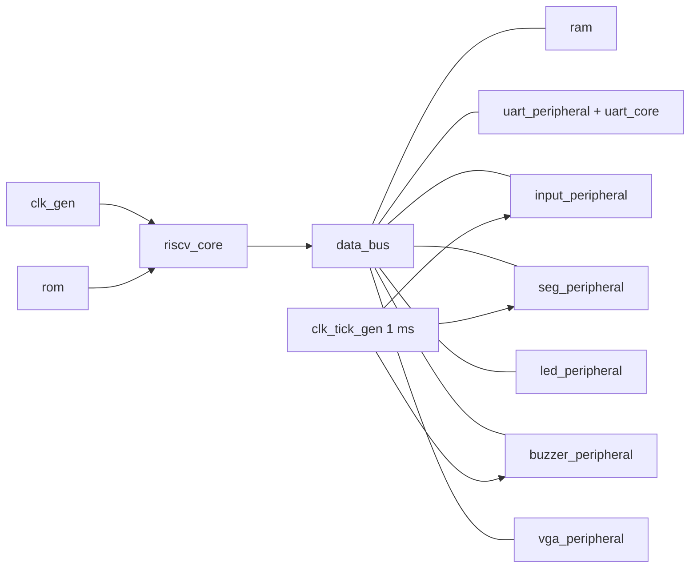

# Integración del sistema — Batalla Naval sobre RISC-V

## 1. `top.sv`

`top.sv` une todos los bloques del diagrama de segundo nivel del planteamiento:

| Parámetro | Valor en la tarjeta | Uso |
|---|---|---|
| `PROGRAM_FILE` | `programa.mem` | Contenido de la ROM |
| `CLK_HZ` | 50 000 000 | Frecuencias del buzzer |
| `TICK_CYCLES` | 50 000 | Tick de 1 ms |
| `DEBOUNCE_MS` | 10 | Filtro de los botones |
| `BAUD_DIV`, `BAUD_X16_DIV` | 434, 27 | 115200 baudios |

Los parámetros solo se cambian en simulación, para acelerarla.

## 2. Pines (`CONSTRAINTS/nexys4_batalla_naval.xdc`)

| Puerto | Pin(es) | Uso |
|---|---|---|
| `clk100_i` | E3 | Reloj de 100 MHz |
| `btn_up_i`, `btn_down_i`, `btn_left_i`, `btn_right_i` | F15, V10, T16, R10 | Navegación |
| `btn_center_i` | E16 | `BTN_RST` |
| `btn_cpu_reset_n_i` | C12 | `BTN_OK` |
| `sw_sel_i` | U9 (SW0) | `BTN_SEL` |
| `uart_rx_i`, `uart_tx_o` | C4, D4 | Puente USB-UART |
| `led_o[15:0]` | T8 … P2 | LD0–LD15 |
| `seg_o[6:0]`, `dp_o`, `an_o[7:0]` | L3 … L6, M4, N6 … M1 | Displays |
| `aud_pwm_o`, `aud_sd_o` | A11, D12 | Salida de audio |
| `vga_r_o`, `vga_g_o`, `vga_b_o` | A3–A4, C6–A6, B7–D8 | Color |
| `vga_hs_o`, `vga_vs_o` | B11, B12 | Sincronismos |

Los pines se tomaron del archivo general de la Nexys 4 (rev B) que proporcionó el curso.

Las entradas asíncronas (botones, switch y RX) se excluyen del análisis de timing con `set_false_path`, porque todas pasan por sincronizadores de dos flip-flops. Los relojes de 50 y 25 MHz los deriva Vivado automáticamente del reloj de entrada a través del PLL.

## 3. Validación del sistema

| Testbench | Programa | Qué revisa | Resultado |
|---|---|---|---|
| `tb_top.sv` | `programas/tb_top.s` | Cada periférico desde los pines, pasando por el CPU y el bus reales (detalle abajo) | PASS, 16 verificaciones |
| `tb_sistema_juego.sv` | `programa.mem` (el juego) | Inicio de una partida desde los pines, con los divisores reales del UART (detalle abajo) | PASS, 20 verificaciones |

Qué revisa `tb_top.sv`:

- la línea TX queda en reposo tras el reinicio y llega `'A'`;
- LED0 se enciende;
- los displays muestran 12 y 34, verificado en el barrido;
- los dos tiles quedan escritos y el VGA genera sincronismo;
- la salida de audio oscila;
- BTNU y CPU RESET encienden LED8 y LED13;
- el eco por UART funciona (envía `0x55` y recibe `0x56`).

Qué revisa `tb_sistema_juego.sv`:

- arranque con `#C`;
- colocación concurrente del J1 (botones) y el J2 (UART), con un rechazo por traslape y basura por UART;
- inicio de batalla con `#B` y `#T1`;
- un disparo del J1 (impacto) y uno del J2 (fallo), revisando tramas, RAM y memoria de video.

`tb_sistema_juego.sv` es también el escenario propuesto para la **simulación post-implementación temporizada**: ejecuta un fragmento representativo del programa y la validación de un disparo.

Para simular en Vivado, agregar como fuentes de simulación el archivo `.mem` correspondiente (`tb_top.mem` o `programa.mem`).

> Resultados obtenidos con Icarus Verilog, con un modelo de comportamiento del PLL y los núcleos UART convertidos a Verilog con GHDL. Deben repetirse en Vivado (con la primitiva `PLLE2_BASE` real) antes de incluirse como evidencia final. Los reportes de recursos, timing y la simulación post-implementación deben obtenerse en Vivado.
