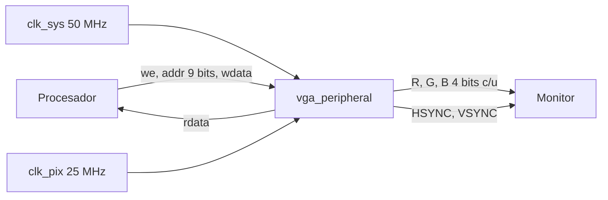
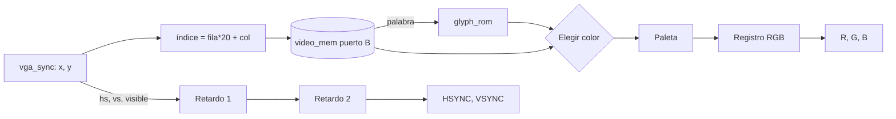

# Periférico VGA — Batalla Naval sobre RISC-V

## 1. Introducción

El periférico VGA muestra al Jugador 1 su tablero, lo que sabe del tablero rival y el HUD. El procesador no dibuja píxel por píxel. La pantalla se divide en una cuadrícula de *tiles* (bloques) y el procesador escribe una palabra por tile; el periférico convierte esas palabras en píxeles en cada barrido.

| Módulo | Función |
|---|---|
| `vga_sync` | Contadores de posición y sincronismos de 640 × 480 a 60 Hz |
| `video_mem` | Memoria de video de doble puerto, 512 × 32 bits |
| `glyph_rom` | Símbolos de 8 × 8 píxeles del HUD |
| `vga_peripheral` | Une todo y genera el color de cada píxel |

## 2. Primer nivel



| Señal | Dirección | Dominio | Descripción |
|---|---|---|---|
| `clk_i`, `rst_i` | Entrada | sistema | Reloj y reinicio del lado del CPU |
| `write_enable_i` | Entrada | sistema | Escritura de un tile |
| `addr_i[8:0]` | Entrada | sistema | Índice del tile (`DataAddress[10:2]`) |
| `wdata_i[31:0]` | Entrada | sistema | Palabra del tile |
| `rdata_o[31:0]` | Salida | sistema | Palabra leída (combinacional) |
| `clk_pix_i`, `rst_pix_i` | Entrada | píxel | Reloj de 25 MHz y su reinicio |
| `vga_r_o`, `vga_g_o`, `vga_b_o` | Salida | píxel | Color de 12 bits |
| `vga_hs_o`, `vga_vs_o` | Salida | píxel | Sincronismos, activos en bajo |

Es el único periférico con dirección de más de 2 bits, porque se comporta como una memoria, tal como indica el enunciado.

## 3. Temporización: `vga_sync`

Parámetros de 640 × 480 a 60 Hz [2]:

| | Visible | Pórtico frontal | Sincronismo | Pórtico trasero | Total |
|---|---|---|---|---|---|
| Horizontal (píxeles) | 640 | 16 | 96 | 48 | 800 |
| Vertical (líneas) | 480 | 10 | 2 | 33 | 525 |

Con 25 MHz, la frecuencia de cuadro es 25 000 000 / (800 × 525) ≈ 59,5 Hz, dentro de la tolerancia de los monitores (el valor nominal del estándar es 25,175 MHz).

## 4. Cuadrícula y formato de la palabra

La cuadrícula es de 20 × 15 tiles de 32 × 32 píxeles (300 tiles):

- **Divisiones exactas:** 640/32 y 480/32 son exactos, y la fila y columna del tile son directamente `y[8:5]` y `x[9:5]`, sin dividir.
- **Cabe en la ventana de video:** la ventana tiene 512 palabras. Con tiles de 16 × 16 harían falta 1200 palabras, que no caben.

```
índice    = fila × 20 + columna = (fila << 4) + (fila << 2) + columna
dirección = 0x0001_1000 + índice × 4
```

| Bits | Campo |
|---|---|
| `[2:0]` | Color de fondo (paleta) |
| `[7:3]` | Símbolo, 0 = ninguno (uso sugerido por el enunciado) |
| `[8]` | Cursor: marco amarillo de 4 píxeles |
| `[11:9]` | Color del símbolo (paleta) |
| `[31:12]` | Reservado, en 0 |

| Índice | Color | RGB | Uso |
|---|---|---|---|
| 0 | Negro | `000` | Fondo |
| 1 | Azul | `05C` | Agua |
| 2 | Gris | `888` | Barco propio |
| 3 | Rojo | `F00` | Impacto |
| 4 | Blanco | `FFF` | Fallo y texto |
| 5 | Verde | `0C0` | Vista previa de colocación |
| 6 | Amarillo | `FF0` | Cursor y títulos |
| 7 | Azul oscuro | `006` | Reservado |

Agua, barco propio, impacto y fallo usan cuatro colores claramente distintos, como exige el enunciado. La distribución de la pantalla está en `docs/diseño/planteamiento.md`, sección 9.3.

## 5. `glyph_rom`

24 símbolos de 8 × 8 dibujados para el proyecto: los dígitos 0–9, las letras A, B, C, F, G, I, J, L, N, O, R, T, U y los dos puntos. Alcanzan para escribir `COLOCAR`, `BATALLA`, `FIN`, `TURNO`, `GANA`, `J1`, `J2` y las victorias.

- **Códigos:** el código de un dígito *d* es *d* + 1, para que el código 0 signifique "sin símbolo". Así, limpiar la pantalla es escribir ceros.
- **Tamaño en pantalla:** cada símbolo se amplía 4 veces (cada bit ocupa 4 × 4 píxeles) para llenar el tile.

## 6. Memoria de doble puerto y dominios de reloj: `video_mem`

| Puerto | Reloj | Acceso |
|---|---|---|
| A (CPU) | `clk_sys` | Escritura síncrona; lectura combinacional, porque el procesador uniciclo necesita el dato de `lw` en el mismo ciclo |
| B (video) | `clk_pix` | Solo lectura, registrada |

**Tratamiento del cruce entre dominios:**

- **No hace falta sincronizar señales:** cada puerto trabaja solo con su propio reloj y no comparten señales de control. La memoria misma resuelve el paso de datos entre dominios.
- **Único caso especial:** que el CPU escriba un tile justo cuando el video lo está leyendo. En ese caso, ese tile puede verse con el valor anterior durante un solo cuadro (16,7 ms). Es imperceptible y se corrige solo en el cuadro siguiente.

Actualizar un tile es una sola instrucción `sw`, sin esperar nada, así que el programa nunca se bloquea por el video.

## 7. Generación de la imagen



La imagen se genera en dos etapas:

1. **Lectura de la memoria:** con `x` e `y` se calcula el índice del tile y se lee la memoria (el registro está dentro de `video_mem`).
2. **Color:** con la palabra leída se consulta la ROM de símbolos (fila `y[4:2]`, columna `x[4:2]`) y se elige el color, en este orden: marco del cursor si el bit 8 vale 1 y el píxel está en el borde, color del símbolo si el bit de la ROM es 1, y si no, color de fondo. Fuera de la zona visible sale negro.

Los sincronismos, la zona visible y la posición dentro del tile se retrasan dos ciclos, para quedar alineados con el color.

## 8. Validación

| Prueba | Resultado |
|---|---|
| Período de línea medido en la salida | 800 ciclos |
| Ancho de HSYNC | 96 ciclos |
| Líneas por cuadro | 525 |
| Ancho de VSYNC | 1600 ciclos (2 líneas) |
| Escritura y lectura desde el CPU (tiles 0 y 299, tile sin escribir) | Correctas |
| Colores en 14 puntos de la pantalla | Correctos |
| Un tile cambia de color con un solo `sw` | Correcto |

`tb_vga_peripheral.sv` usa relojes de sistema y de píxel sin relación de fase. **Resultado: PASS en las 23 verificaciones** (Icarus Verilog).

- **Posición reconstruida desde afuera:** la posición de cada píxel se reconstruye solo a partir de los flancos de HSYNC y VSYNC de salida.
- **Bordes exactos:** entre los puntos revisados están los bordes del trazo de un símbolo (x = 11 negro, x = 12 blanco, x = 19 blanco, x = 20 negro) y del marco del cursor. Eso demuestra que la imagen está alineada píxel a píxel con los sincronismos: un retraso mal compensado corre la imagen y hace fallar estas pruebas.
- **Depuración del testbench:** una primera versión daba falsos FAIL por una carrera entre dos bloques de simulación que usaban el mismo flanco de reloj. Se corrigió capturando los colores en el mismo bloque que reconstruye la posición.

> Resultados obtenidos con Icarus Verilog. Deben repetirse en Vivado antes de incluirse como evidencia final.

## Referencias

[2] P. P. Chu. *FPGA Prototyping by SystemVerilog Examples*. Wiley, 2018.
