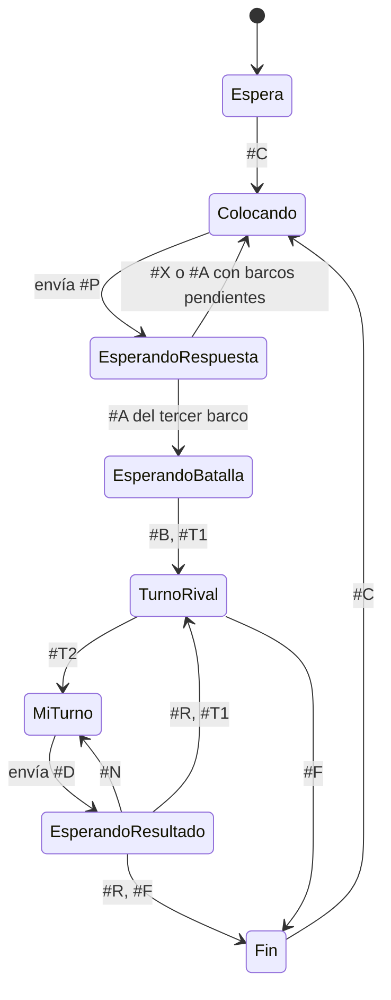

# Aplicación de PC del Jugador 2 — Batalla Naval sobre RISC-V

## 1. Introducción

La aplicación es la terminal del Jugador 2:

- pide la colocación de sus barcos y sus disparos;
- los envía por UART;
- muestra lo que la FPGA le informa.

**No contiene reglas del juego.** No decide si un barco se traslapa, si un disparo acierta, si un barco se hundió ni quién gana. Eso lo responde la FPGA. La aplicación solo valida el formato y el rango de lo que escribe el usuario, para no enviar tramas mal formadas.

## 2. Instalación y uso

Requiere Python 3 y pyserial:

```
pip install pyserial
cd PYTHON/DESIGN
python jugador2.py            (lista los puertos disponibles)
python jugador2.py COM5       (Windows; en Linux, por ejemplo /dev/ttyUSB1)
```

Si la FPGA ya estaba encendida al abrir la aplicación, presionar `BTN_RST` para que envíe `#C` y empiece una partida.

## 3. Estructura

| Archivo | Contenido |
|---|---|
| `protocolo.py` | Arma las tramas `#P` y `#D`, reconoce las tramas de la FPGA y valida lo que escribe el usuario |
| `cliente.py` | `ClienteJ2`: tableros vistos por el J2, fase, turno y qué pedir al usuario. No usa el puerto serie |
| `jugador2.py` | Interfaz de consola con pyserial y dos hilos |

Separar `cliente.py` del puerto serie permite probar la lógica de la aplicación sin la tarjeta (sección 6).

## 4. Hilos

- **Hilo lector:** lee líneas del puerto (cada trama de la FPGA termina en `\n`) y las pone en una cola.
- **Hilo principal:** procesa la cola, redibuja los tableros y pide datos al usuario cuando corresponde.

Con el hilo lector, los mensajes que llegan mientras el usuario escribe no se pierden. Si mientras el usuario escribía llegó algo que cambia la situación (por ejemplo `#C` por `BTN_RST`), esa entrada se descarta. Si la FPGA no responde en 3 segundos, se avisa al usuario y se permite volver a enviar.

## 5. Estados



| Mensaje de la FPGA | Acción de la aplicación |
|---|---|
| `#C` | Reinicia la vista y pide el barco 0 |
| `#A b` | Dibuja el barco que había enviado y pide el siguiente |
| `#X b m` | Muestra el motivo y vuelve a pedir el mismo barco |
| `#B`, `#T j` | Muestra el turno; con `#T2` pide un disparo |
| `#R f c r` | Marca el resultado de su disparo en el tablero rival |
| `#N f c` | Avisa que la casilla ya fue atacada y vuelve a pedir |
| `#E f c r` | Marca el disparo del J1 en su propio tablero |
| `#F ...` | Muestra el ganador y el resumen |

Pantalla de la consola:

```
   Su tablero          Tablero del rival
   0 1 2 3 4 5 6 7     0 1 2 3 4 5 6 7
0  B ~ ~ ~ ~ B ~ ~   0 . . . . . . . .
...
   ~ agua  B barco  X impacto  o fallo  . sin disparar
```

Entradas aceptadas:

- **Colocación:** `3 4 H`, `3,4,v` o `34h`.
- **Disparo:** `2 5`, `2,5` o `25`.

Fila y columna van de 0 a 7.

## 6. Validación

`PYTHON/SIMULATION/prueba_app.py`:

1. **Pruebas unitarias:** tramas válidas e inválidas (`#A3`, `#E88F`, `#F12`, etc.) y entradas mal escritas o fuera de rango.
2. **Partida completa:** la lógica de la aplicación (`ClienteJ2`) juega contra el programa real de la FPGA (`programa.mem`), ejecutado en el simulador de instrucciones de `ASSEMBLY/SIMULATION`, que además hace de Jugador 1. Casos:
   - la FPGA rechaza un traslape y la aplicación vuelve a pedir el barco;
   - una casilla repetida recibe `#N`;
   - la aplicación nunca ve barcos del J1;
   - al final muestra el resumen;
   - `BTN_RST` reinicia su vista.

**Resultado: PASS, 53 verificaciones.**

Además se probó `jugador2.py` completo con un puerto serie virtual conectado al simulador de la FPGA, escribiendo como un usuario: una entrada inválida, un rechazo por traslape y tres barcos aceptados.

```
cd PYTHON/SIMULATION
python3 prueba_app.py ../../FPGA/DESIGN/programa.mem
```

> Estas pruebas no reemplazan la prueba con la tarjeta, que debe documentarse aparte.
