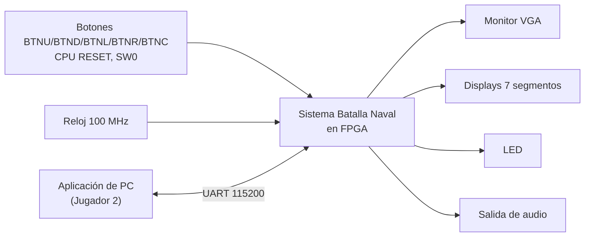
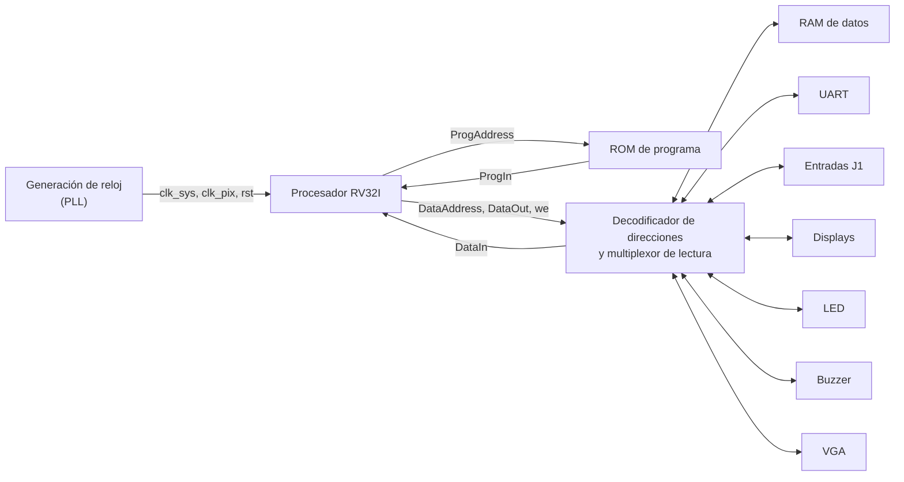
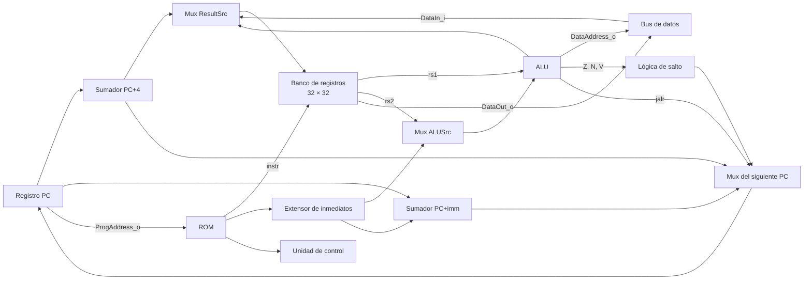
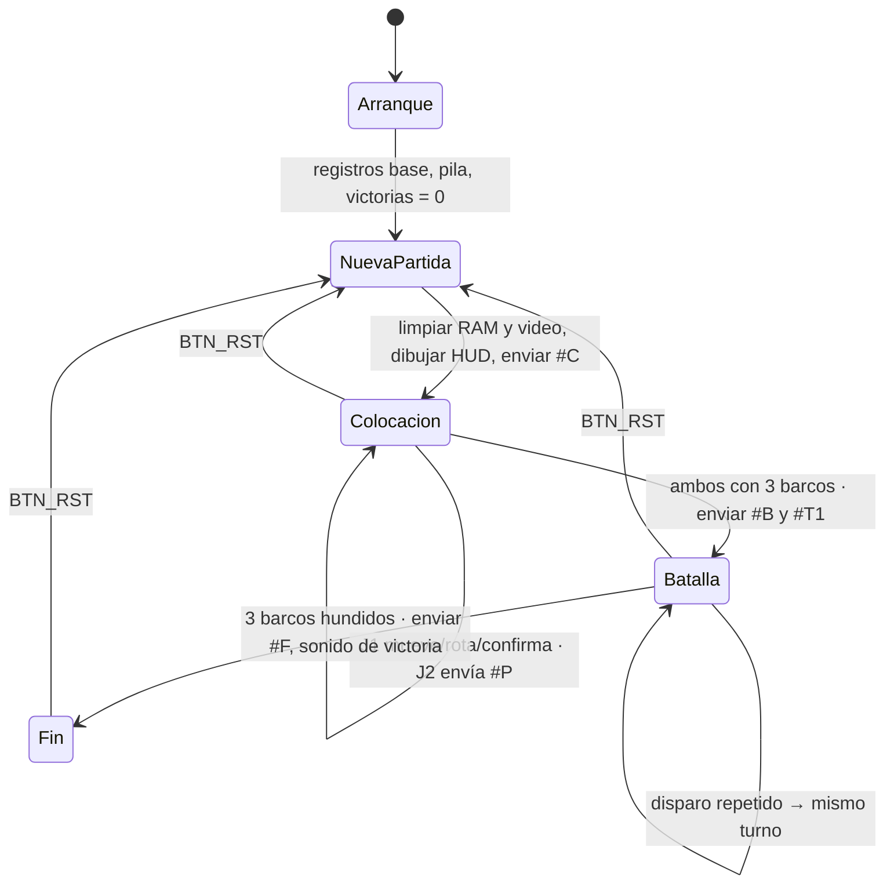
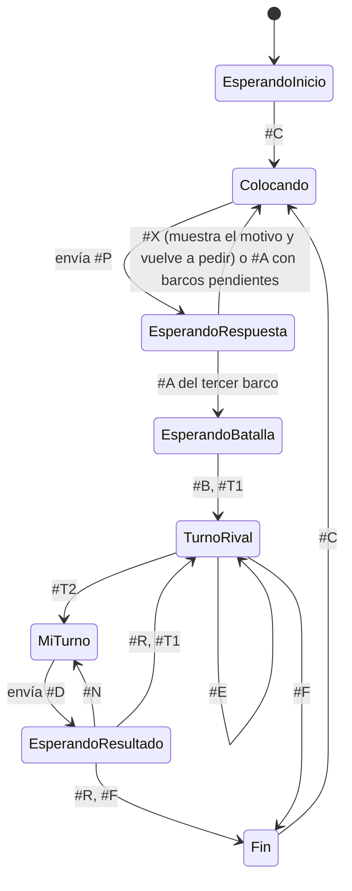

# Planteamiento del diseño — Proyecto 3

**EL3313 Taller de Diseño Digital — Batalla Naval sobre RISC-V con periférico VGA**

Sigue la metodología de diseño modular (top-down).

## 1. Comprensión del problema

Se debe implementar el juego Batalla Naval para dos jugadores sobre una FPGA Nexys 4. Cada jugador tiene un tablero de 8 × 8 con tres barcos (de 4, 3 y 2 casillas) que se colocan en horizontal o vertical sin salirse del tablero ni traslaparse. Después, los jugadores disparan por turnos; un barco se hunde cuando todas sus casillas fueron impactadas y gana quien hunda los tres barcos del rival.

La diferencia con los proyectos anteriores es dónde vive la lógica del juego: **todas las reglas se ejecutan como un programa en ensamblador sobre un procesador RISC-V (RV32I) diseñado por el equipo**. El hardware es la plataforma: procesador, memorias y periféricos mapeados en memoria. Los periféricos solo hacen entrada y salida de bajo nivel (sincronismos VGA, antirrebote, transmisión serial, generación de tonos).

- **Jugador 1:** juega en la FPGA con un monitor VGA, botones, displays de 7 segmentos, LED y sonido.
- **Jugador 2:** juega desde una aplicación de PC en Python conectada por UART. La aplicación es solo una terminal: muestra información y envía órdenes, pero no decide nada del juego.

Restricciones principales:

- Mapa de memoria fijo: ROM `0x0000_0000–0x0000_1FFF`, RAM `0x0000_2000–0x0000_2FFF`, periféricos `0x0001_0000–0x0001_FFFF` con direcciones definidas para cada uno.
- Interfaz del procesador fija (`ProgAddress_o`, `ProgIn_i`, `DataAddress_o`, `DataOut_o`, `DataIn_i`, `we_o`) y una interfaz común para los periféricos de registros (`addr_i[1:0]`).
- VGA de 640 × 480 a 60 Hz con memoria de video por tiles de doble puerto.
- Reutilizar el UART del Proyecto 2 a 115200 baudios.
- La información privada de cada jugador nunca se muestra al otro.
- Simulación post-implementación temporizada obligatoria.

## 2. Investigación previa

| Tema | Resumen | Referencia |
|---|---|---|
| Arquitectura RV32I | 32 registros de 32 bits (`x0` siempre 0); instrucciones de 32 bits en formatos R, I, S, B, U y J; el campo `opcode` define el formato y `funct3`/`funct7` la operación | [1, cap. 6] |
| Microarquitectura uniciclo | Cada instrucción se ejecuta en un ciclo; el datapath tiene PC, memoria de instrucciones, banco de registros, extensor de inmediatos, ALU y memoria de datos; la unidad de control se divide en decodificador principal y decodificador de la ALU | [1, cap. 7] |
| Convención de llamadas | Uso de `ra`, `sp`, registros `a`, `t` y `s`; manejo de la pila en llamadas anidadas | [1, cap. 6] |
| E/S mapeada en memoria | Los periféricos se acceden con `lw`/`sw` a direcciones reservadas; un decodificador de direcciones habilita el dispositivo correcto y un multiplexor elige el dato leído | [1, cap. 9] |
| Temporización VGA | 640 × 480 a 60 Hz: 800 × 525 ciclos de píxel por cuadro a 25 MHz, con pórticos y pulsos de sincronismo activos en bajo | [2] |
| Gráficos por tiles y texto | La pantalla se divide en bloques; la posición del píxel indexa una memoria de tiles y una ROM de caracteres | [2] |
| Antirrebote | Sincronizador de dos flip-flops y contador que exige un nivel estable durante un tiempo | [2] |
| UART | Trama de 1 bit de inicio, 8 de datos y 1 de parada; recepción con sobremuestreo ×16 | [2]; UART del Proyecto 2 |
| pyserial | Biblioteca de Python para abrir el puerto serie, leer y escribir bytes | Documentación de pyserial |
| Batalla Naval | Reglas descritas en la sección 1 según el enunciado | Enunciado del proyecto |

## 3. Objetivos de la solución

1. El procesador ejecuta correctamente las 27 instrucciones base del enunciado, verificado con un testbench autoverificable que reporta PASS en cada una.
2. El sistema completo cierra timing con el reloj del sistema elegido (slack no negativo en el reporte de implementación).
3. La señal VGA cumple 800 × 525 ciclos de píxel por cuadro con pulsos de sincronismo de 96 píxeles y 2 líneas, verificado en simulación.
4. Una casilla de la pantalla se actualiza con una sola instrucción `sw`.
5. Toda trama UART inválida se descarta sin cambiar tableros, turno ni estado de colocación, verificado enviando basura en simulación y en la tarjeta.
6. Ambos jugadores pueden colocar sus barcos al mismo tiempo sin que uno bloquee al otro.
7. Se completa una partida entera en la tarjeta, incluyendo colocación rechazada, disparo repetido, hundimiento, victoria y `BTN_RST` conservando las victorias.
8. Existe simulación post-implementación temporizada de un fragmento del programa y de la validación de un disparo.

## 4. Diagrama de primer nivel



**Objetivo:** permitir una partida de Batalla Naval entre un jugador local y uno remoto.

**Entradas:** reloj de 100 MHz, cuatro botones de navegación, `BTN_SEL` (SW0), `BTN_OK` (CPU RESET), `BTN_RST` (BTNC) y la línea RX del UART.

**Salidas:** señal VGA (RGB de 12 bits, HSYNC, VSYNC), segmentos y ánodos de los displays, LED, audio PWM y la línea TX del UART.

**Explicación general:** el sistema lee las acciones del Jugador 1 desde los botones y las del Jugador 2 desde el UART, aplica las reglas del juego y muestra el estado a cada jugador por su propia interfaz.

## 5. Diagrama de segundo nivel



| Bloque | Objetivo | Entradas | Salidas |
|---|---|---|---|
| Generación de reloj | Obtener los relojes del sistema y de píxel y el reinicio general | 100 MHz | `clk_sys`, `clk_pix`, `rst` |
| Procesador RV32I | Ejecutar el programa del juego | Instrucción, dato leído | Dirección de programa, dirección y dato de escritura, `we` |
| ROM de programa | Guardar el programa | Dirección de programa | Instrucción |
| RAM de datos | Guardar tableros y variables | Dirección, dato, `we` | Dato leído |
| Decodificador de direcciones | Dirigir cada acceso al destino correcto según el mapa de memoria | Bus de datos del CPU | Habilitaciones, `addr_i` y dato leído |
| UART | Comunicación con la aplicación de PC | Registros, RX | TX, registros |
| Entradas J1 | Entregar el estado filtrado de los botones | Botones, switch | Registro de estado |
| Displays | Mostrar las victorias acumuladas | Registro de datos | Segmentos y ánodos |
| LED | Indicar la fase | Registro de datos | LED |
| Buzzer | Generar los sonidos de eventos | Registro de control | Audio PWM |
| VGA | Generar la imagen a partir de la memoria de tiles | Escrituras del CPU, `clk_pix` | RGB, HSYNC, VSYNC |

**Explicación del sistema:** el procesador lee instrucciones de la ROM por un bus propio. Todos los demás accesos pasan por el bus de datos: según la dirección, el decodificador conecta el acceso con la RAM o con un periférico. Así el programa maneja todo con `lw` y `sw`, sin instrucciones especiales de entrada/salida.

## 6. Diagrama de tercer nivel

### 6.1. Procesador uniciclo

El procesador sigue la microarquitectura uniciclo de [1, cap. 7], extendida con las instrucciones de desplazamiento, comparación y saltos condicionales que pide el enunciado.



| Bloque | Función |
|---|---|
| Registro PC | Guarda la dirección de la instrucción actual; vale `0x0000_0000` tras el reinicio |
| Sumadores | `PC + 4` (siguiente instrucción y dirección de retorno) y `PC + imm` (destino de `beq`, `bne`, `blt`, `bge` y `jal`) |
| Banco de registros | Dos lecturas combinacionales y una escritura en el flanco de reloj; `x0` siempre lee 0 |
| Extensor de inmediatos | Arma el inmediato con signo de los formatos I, S, B y J |
| ALU | `add`, `sub`, `and`, `or`, `xor`, `slt`, `sltu`, `sll`, `srl`, `sra`; entrega también las banderas cero (Z), negativo (N) y desbordamiento (V) de la resta |
| Lógica de salto | `beq`: Z; `bne`: no Z; `blt`: N ⊕ V; `bge`: no (N ⊕ V) |
| Mux del siguiente PC | `PC + 4`, `PC + imm` (salto tomado o `jal`) o `(rs1 + imm)` con el bit 0 en cero (`jalr`) |
| Mux ResultSrc | Escribe en el registro destino el resultado de la ALU, el dato leído o `PC + 4` (`jal`, `jalr`) |

**Decodificador principal** (por `opcode`):

| Instrucciones | `opcode` | RegWrite | ImmSrc | ALUSrc | MemWrite | ResultSrc | Branch | Jump |
|---|---|---|---|---|---|---|---|---|
| Tipo R (`add`…`sra`) | `0110011` | 1 | — | reg | 0 | ALU | 0 | 0 |
| Tipo I aritméticas | `0010011` | 1 | I | imm | 0 | ALU | 0 | 0 |
| `lw` | `0000011` | 1 | I | imm | 0 | Memoria | 0 | 0 |
| `sw` | `0100011` | 0 | S | imm | 1 | — | 0 | 0 |
| Saltos condicionales | `1100011` | 0 | B | reg | 0 | — | 1 | 0 |
| `jal` | `1101111` | 1 | J | — | 0 | PC+4 | 0 | 1 |
| `jalr` | `1100111` | 1 | I | imm | 0 | PC+4 | 0 | 1 |

**Decodificador de la ALU:** con `funct3` y el bit 30 de la instrucción (`funct7[5]`) elige la operación. El bit 30 distingue `sub` de `add` y `sra`/`srai` de `srl`/`srli`; en las instrucciones tipo I solo se usa para los desplazamientos, porque en `addi` ese bit es parte del inmediato. En los saltos condicionales la ALU siempre resta.

### 6.2. Periféricos

| Bloque | Componentes internos |
|---|---|
| Generación de reloj | PLL (Clocking Wizard) y un sincronizador de reinicio por dominio |
| Decodificador de direcciones | Comparadores de los bits altos de la dirección y multiplexor de lectura (sección 7.3) |
| Entradas J1 | Por entrada: sincronizador de 2 flip-flops, contador de estabilidad de 10 ms; registro de estado de 7 bits |
| Displays | Contador de refresco de 1 ms, contador de dígito de 2 bits, multiplexor de nibble, decodificador BCD a 7 segmentos |
| LED | Registro de 16 bits |
| Buzzer | Registro de evento, contador de semiperiodo por tono, contador de duración en milisegundos |
| UART | Periférico del Proyecto 2: registros de control, TX y RX sobre el núcleo de transmisión y recepción |
| VGA | Contadores horizontal (0–799) y vertical (0–524), comparadores de sincronismo y zona visible, memoria de tiles de doble puerto, ROM de símbolos, paleta y registros de retardo (secciones 9.7 y 9.8) |

## 7. Mapa de memoria, relojes y registros de periféricos

### 7.1. Relojes y reinicio

| Reloj | Frecuencia | Origen | Lo usan |
|---|---|---|---|
| `clk_sys` | 50 MHz | PLL | CPU, ROM, RAM, puerto A de la memoria de video, UART, entradas, displays, LED, buzzer |
| `clk_pix` | 25 MHz | PLL | Generación VGA y puerto B de la memoria de video |

Ambos salen del mismo PLL a partir de los 100 MHz de la tarjeta. Los 50 MHz del sistema son una estimación para un procesador uniciclo con memorias de lectura combinacional; el valor final se ajusta con el análisis de timing después de implementar (si no cierra, se baja a 25 MHz cambiando solo el PLL y los parámetros de divisores). Los periféricos reutilizados del Proyecto 2 ya tienen la frecuencia de reloj como parámetro (`CLK_HZ`, `BAUD_DIV`, `TICK_CYCLES`), por lo que solo se recalculan sus valores:

| Parámetro | 100 MHz (P2) | 50 MHz (P3) |
|---|---|---|
| `BAUD_DIV` (UART, 115200 baud) | 868 | 434 |
| `BAUD_X16_DIV` | 54 | 27 |
| `TICK_CYCLES` (tick de 1 ms) | 100 000 | 50 000 |

**Reinicio general.** `rst` es síncrono y activo en alto. Se mantiene activo mientras el PLL no está enclavado (`locked = 0`) y se libera sincronizado a cada dominio de reloj. Solo ocurre al programar o encender la tarjeta, y es lo único que pone en cero las victorias acumuladas.

**`BTN_RST`** no reinicia el hardware: el programa lo lee del registro de entradas y salta a la rutina de nueva partida, que conserva las victorias (sección 8.4).

### 7.2. Mapa de memoria

| Región | Rango | Tamaño | Implementación |
|---|---|---|---|
| ROM de programa | `0x0000_0000–0x0000_1FFF` | 2048 palabras | Lectura combinacional (LUTs), cargada con `$readmemh` desde el ensamblador |
| RAM de datos | `0x0000_2000–0x0000_2FFF` | 1024 palabras | Escritura síncrona, lectura combinacional (LUTs) |
| Periféricos de registros | `0x0001_0040–0x0001_014F` | | Ver 7.3 |
| Memoria de video | `0x0001_1000–0x0001_17FF` | 512 palabras (300 usadas) | Doble puerto, sección 9.7 |

La ROM y la RAM usan lectura combinacional porque en un procesador uniciclo la instrucción y el dato leído deben estar disponibles en el mismo ciclo [1, cap. 7]. La ROM solo se accede por el bus de programa (`ProgAddress_o`/`ProgIn_i`); el bus de datos no la lee.

Un acceso de datos a una dirección no asignada lee 0 y una escritura no tiene efecto.

### 7.3. Decodificación de direcciones

El decodificador compara los bits altos de `DataAddress_o` y activa el `write_enable_i` de un solo destino; los bits bajos se pasan como `addr_i`.

| Destino | Condición sobre `DataAddress_o` | `addr_i` |
|---|---|---|
| RAM | `[31:12] = 0x00002` | `[11:2]` |
| UART | `[31:4] = 0x0001_004` | `[3:2]` |
| Entradas J1 | `[31:4] = 0x0001_012` | `[3:2]` |
| Displays | `[31:3] = 0x0001_013` y `[3] = 0` (`0x130–0x137`) | `{0, [2]}` |
| LED | `[31:3]` con `0x0001_0138–0x0001_013F` | `{0, [2]}` |
| Buzzer | `[31:4] = 0x0001_014` | `[3:2]` |
| Memoria de video | `[31:11] = 0x0001_1000 >> 11` (`0x1000–0x17FF`) | `[10:2]` (9 bits) |

Los displays y el LED se decodifican en bloques de 8 bytes porque el enunciado ubica el LED en `0x138`, dentro del bloque de 16 bytes que empieza en `0x130`.

El dato leído (`DataIn_i`) se elige con un multiplexor según el mismo decodificador.

### 7.4. Entradas del Jugador 1 — `0x0001_0120`

Un solo registro de solo lectura (`addr_i = 00`) con el nivel ya filtrado de cada entrada (1 = activa). Las escrituras se ignoran.

| Bit | Entrada | Pin físico |
|---|---|---|
| 0 | Arriba | BTNU |
| 1 | Abajo | BTND |
| 2 | Izquierda | BTNL |
| 3 | Derecha | BTNR |
| 4 | `BTN_SEL` | Switch SW0 |
| 5 | `BTN_OK` | Botón CPU RESET (activo en bajo; el periférico lo invierte) |
| 6 | `BTN_RST` | BTNC (botón central, como indica el enunciado) |
| 31:7 | 0 | |

La Nexys 4 tiene cinco pulsadores más el botón CPU RESET; como el enunciado fija `BTN_RST` en el botón central y la navegación necesita los cuatro restantes, `BTN_OK` usa el botón CPU RESET (que en este diseño no se usa como reinicio) y `BTN_SEL` usa un switch.

Cada entrada pasa por un sincronizador de dos flip-flops (son asíncronas respecto a `clk_sys`) y un filtro antirrebote de 10 ms, reutilizados del Proyecto 2 [2].

El periférico entrega niveles, no pulsos. El programa detecta cada pulsación comparando con la lectura anterior guardada en RAM: para los botones cuenta el cambio de 0 a 1; para `BTN_SEL` cuenta cualquier cambio de posición del switch.

### 7.5. Displays de 7 segmentos — `0x0001_0130`

| `addr_i` | Registro | Acceso | Bits |
|---|---|---|---|
| `00` | DATOS | L/E | `[3:0]` dígito 0, `[7:4]` dígito 1, `[11:8]` dígito 2, `[15:12]` dígito 3, en BCD. `[31:16]` sin uso |

Valor tras reinicio: 0. El programa escribe las victorias del J1 en los dígitos 3–2 y las del J2 en los dígitos 1–0. Un nibble mayor a 9 apaga ese dígito.

| Dígito | Ánodo | Muestra |
|---|---|---|
| 3 | AN5 | Decenas del J1 |
| 2 | AN4 | Unidades del J1 |
| 1 | AN1 | Decenas del J2 |
| 0 | AN0 | Unidades del J2 |

Los contadores de cada jugador quedan en bloques distintos de la tarjeta para que no se lean como un solo número de cuatro cifras; AN2, AN3, AN6 y AN7 quedan apagados. El periférico multiplexa los cuatro dígitos a 250 Hz (un dígito por milisegundo), como en el Proyecto 2.

### 7.6. LED de estado — `0x0001_0138`

| `addr_i` | Registro | Acceso | Bits |
|---|---|---|---|
| `00` | DATOS | L/E | `[15:0]` un bit por LED (LD0–LD15). `[31:16]` sin uso |

Valor tras reinicio: 0. El hardware solo copia el registro a los LED; el significado lo fija el programa:

| LED | Encendido cuando |
|---|---|
| LD0 | Fase de colocación |
| LD1 | Fase de batalla |
| LD2 | Resultado final |

### 7.7. Buzzer — `0x0001_0140`

| `addr_i` | Registro | Acceso | Bits |
|---|---|---|---|
| `00` | CONTROL | E | `[2:0]` evento: escribir un valor distinto de 0 inicia ese sonido |
| `00` | ESTADO | L | `[0]` 1 mientras suena |

| Evento | Sonido | Duración |
|---|---|---|
| 1 Impacto | 2 kHz | 100 ms |
| 2 Fallo | 500 Hz | 150 ms |
| 3 Barco hundido | 3 kHz → 2 kHz → 3 kHz | 80 ms cada tono |
| 4 Colocación inválida | 250 Hz | 250 ms |
| 5 Victoria | 2 kHz → 2,5 kHz → 3 kHz | 150 ms cada tono |

Se reutiliza el generador de tonos del Proyecto 2 con estos eventos. El impacto es agudo y corto, el fallo grave, el hundido alterna dos tonos, la colocación inválida es el más grave y largo, y la victoria sube de tono. El sonido sale por la salida de audio PWM de la tarjeta (pines `AUD_PWM` y `AUD_SD`), porque la Nexys 4 no trae zumbador. Si se pide un sonido mientras otro está sonando, el nuevo reemplaza al anterior.

### 7.8. UART — `0x0001_0040`

Ver sección 10.1.

## 8. Organización de RAM

La RAM de datos ocupa `0x0000_2000–0x0000_2FFF` (4 KB). El procesador solo implementa `lw` y `sw` para acceder a memoria, por lo que todos los datos del juego se guardan en palabras de 32 bits.

### 8.1. Alternativas consideradas

| | A. Una palabra por casilla | B. Mapas de bits | C. Lista de barcos |
|---|---|---|---|
| Idea | 64 palabras por jugador; cada una indica si hay barco (y cuál) y si ya fue disparada | 64 bits por tablero en 2 palabras: ocupadas, disparadas y una máscara por barco | Se guarda solo cada barco (fila, columna, orientación, impactos) y un tablero de disparos |
| Memoria aproximada | ~600 B | ~60 B | ~300 B |
| Dirección de una casilla | `base + ((fila << 3) + col) << 2` | bit `fila·8 + col` repartido en dos palabras | hay que recorrer los barcos |
| Validar traslape | revisar 2 a 4 casillas | `and` de máscaras; los barcos verticales cruzan entre las dos palabras | comparar contra cada barco |
| Detectar hundido | contador de casillas restantes por barco | `(barco & disparos) == barco` | contar impactos del barco |
| Depuración en simulación | directa, casilla por casilla | hay que interpretar bits | intermedia |

Se eligió la **alternativa A**. Con solo `lw`/`sw` cada acceso es directo, la dirección se calcula con dos desplazamientos y una suma, y el contenido de la RAM se puede leer casilla por casilla en la simulación. El consumo de memoria no es una limitación porque se usa menos del 20 % de la RAM.

### 8.2. Formato de una casilla

| Bits | Significado |
|---|---|
| `[1:0]` | 0 = agua, 1 = barco 0 (4 casillas), 2 = barco 1 (3 casillas), 3 = barco 2 (2 casillas) |
| `[2]` | 1 = casilla ya disparada |
| `[31:3]` | Sin uso, siempre en 0 |

El agua se codifica como 0 para que limpiar un tablero sea escribir ceros. No existe un segundo tablero con lo que cada jugador sabe del rival: esa vista se obtiene del tablero del rival mostrando solo las casillas disparadas (disparada con barco = impacto, disparada sin barco = fallo, no disparada = agua). Así la posición de los barcos no descubiertos existe en un solo lugar.

Procesamiento de un disparo sobre una casilla con contenido `v`:

1. Si `v & 4 ≠ 0`, la casilla ya fue disparada: se ignora y no se consume el turno.
2. Si `v & 3 = 0`, es fallo; si no, es impacto sobre el barco `(v & 3) − 1`.
3. En un impacto se resta 1 a las casillas restantes de ese barco; si llega a 0, el barco está hundido.
4. Se escribe `v | 4` en la casilla.

La partida termina cuando un jugador suma 3 barcos hundidos del rival.

### 8.3. Mapa de RAM

| Dirección | Desplazamiento desde `gp` | Contenido | Se limpia al iniciar partida |
|---|---|---|---|
| `0x2000–0x20FF` | -2048 a -1793 | Tablero del Jugador 1 (64 palabras) | Sí |
| `0x2100–0x21FF` | -1792 a -1537 | Tablero del Jugador 2 (64 palabras) | Sí |
| `0x2200`, `0x2204`, `0x2208` | -1536, -1532, -1528 | J1: casillas restantes de los barcos 0, 1 y 2 | Sí |
| `0x220C` | -1524 | J1: barcos colocados (bit *i* = barco *i* colocado) | Sí |
| `0x2210`, `0x2214`, `0x2218` | -1520, -1516, -1512 | J2: casillas restantes de los barcos 0, 1 y 2 | Sí |
| `0x221C` | -1508 | J2: barcos colocados (bit *i* = barco *i* colocado) | Sí |
| `0x2220` | -1504 | Fase: 0 colocación, 1 batalla, 2 fin | Sí |
| `0x2224` | -1500 | Turno: 0 = J1, 1 = J2 | Sí |
| `0x2228` | -1496 | Disparos válidos del J1 | Sí |
| `0x222C` | -1492 | Disparos válidos del J2 | Sí |
| `0x2230` | -1488 | Barcos del J2 hundidos por el J1 | Sí |
| `0x2234` | -1484 | Barcos del J1 hundidos por el J2 | Sí |
| `0x2238` | -1480 | Ganador | Sí |
| `0x2240–0x224C` | -1472 a -1460 | Cursor del J1: fila, columna, orientación, barco actual | Sí |
| `0x2250` | -1456 | Última lectura del registro de entradas (para detectar pulsaciones) | Sí, y se recarga con la lectura actual |
| `0x2280–0x22FF` | -1408 a -1281 | Buffer de recepción UART (tamaño final según el protocolo) | Sí |
| `0x2300–0x2EFF` | -1280 a 1791 | Pila (crece hacia abajo desde `0x2F00`) | No |
| `0x2F00` | 1792 | Victorias acumuladas del J1 | No |
| `0x2F04` | 1796 | Victorias acumuladas del J2 | No |

El estado de colocación se guarda como máscara y no como contador porque el Jugador 2 puede enviar los barcos en cualquier orden; la máscara permite además rechazar un barco que ya fue colocado.

Todas las variables se leen y escriben con `lw`/`sw` relativos a `gp = 0x0000_2800` (sección 11.2).

La pila se inicializa con `sp = 0x0000_2F00` y crece hacia direcciones menores, de modo que nunca alcanza las victorias acumuladas. Dispone de `0x2300–0x2EFF` (3 KB), mucho más de lo que necesita el programa.

### 8.4. Reinicio de partida

Al iniciar una nueva partida se limpia `0x2000–0x22FF` y se recargan las casillas restantes (4, 3 y 2). Las victorias acumuladas no se tocan. Después de limpiar se guarda en `0x2250` la lectura actual de las entradas, para que el propio `BTN_RST` que sigue presionado no se cuente como una pulsación nueva.

`BTN_RST` lo lee el software desde el registro de entradas y salta a la rutina de nueva partida; `rst_i` del procesador solo se activa en el arranque general, que sí pone las victorias en 0 (sección 7.1).

## 9. Memoria de video y distribución de tiles

### 9.1. Temporización VGA

Se genera 640 × 480 a 60 Hz con reloj de píxel de 25 MHz obtenido del PLL, siguiendo los parámetros de [2]:

| | Visible | Pórtico frontal | Sincronismo | Pórtico trasero | Total |
|---|---|---|---|---|---|
| Horizontal (píxeles) | 640 | 16 | 96 | 48 | 800 |
| Vertical (líneas) | 480 | 10 | 2 | 33 | 525 |

Ambos sincronismos son activos en bajo. La frecuencia de cuadro resultante es 25 MHz / (800 × 525) ≈ 59,5 Hz, dentro de la tolerancia de los monitores (el valor nominal del estándar es 25,175 MHz). La tarjeta Nexys 4 tiene salida VGA de 12 bits (4 por canal).

### 9.2. Cuadrícula

Se usan **20 × 15 tiles de 32 × 32 píxeles** (300 tiles). Se eligió porque:

- 640 / 32 = 20 y 480 / 32 = 15 son exactos, y 32 es potencia de 2: la fila y columna del tile son simplemente `y[8:5]` y `x[9:5]`, y la posición dentro del tile es `y[4:0]` y `x[4:0]`, sin divisiones.
- Cabe en la ventana de video del mapa de memoria: `0x1000–0x17FF` son 2 KB = 512 palabras, y se usan 300. Con tiles de 16 × 16 harían falta 40 × 30 = 1200 palabras, que no caben.
- Alcanza para los dos tableros de 8 × 8 con sus números de fila y columna y cuatro filas de HUD.

Índice y dirección de un tile:

```
índice    = fila × 20 + columna = (fila << 4) + (fila << 2) + columna
dirección = 0x0001_1000 + índice × 4
```

En hardware y en ensamblador la multiplicación por 20 se hace con dos desplazamientos y una suma.

### 9.3. Distribución de la pantalla

```
col:  0 1 2 3 4 5 6 7 8 9 10 11 12 13 14 15 16 17 18 19
fila 0   J 1 : 0 0   J 2 : 0  0                           victorias acumuladas
fila 1   C O L O C A R                                     fase (COLOCAR / BATALLA / FIN)
fila 2
fila 3   J 1                   J  2                        títulos de los tableros
fila 4   0 1 2 3 4 5 6 7       0  1  2  3  4  5  6  7      números de columna
fila 5 0 . . . . . . . .    0  .  .  .  .  .  .  .  .
 ...   .  tablero propio    .     tablero rival
fila12 7 . . . . . . . .    7  .  .  .  .  .  .  .  .
fila13
fila14   T U R N O   J 1                                   turno o ganador
```

| Zona | Filas | Columnas |
|---|---|---|
| Victorias acumuladas | 0 | 1–11 |
| Fase | 1 | 1–7 |
| Títulos | 3 | 1–2 y 11–12 |
| Números de columna | 4 | 1–8 y 11–18 |
| Números de fila | 5–12 | 0 y 10 |
| Tablero propio (J1) | 5–12 | 1–8 |
| Tablero rival (J2) | 5–12 | 11–18 |
| Turno / ganador | 14 | 1–8 |

La casilla (f, c) del tablero propio está en el tile (5 + f, 1 + c) y la del rival en (5 + f, 11 + c).

### 9.4. Formato de la palabra de video

| Bits | Campo | Descripción |
|---|---|---|
| `[2:0]` | Color de fondo | Índice de la paleta (tabla 9.5) |
| `[7:3]` | Símbolo | 0 = sin símbolo; otro valor dibuja el carácter de la tabla 9.6 (uso sugerido por el enunciado) |
| `[8]` | Cursor | 1 = dibuja un marco de 4 píxeles en el borde del tile |
| `[11:9]` | Color del símbolo | Índice de la paleta |
| `[31:12]` | Reservado | Se escriben en 0 |

Escribir 0 en un tile lo deja negro y sin símbolo, así que limpiar la pantalla es escribir ceros en los 300 tiles.

### 9.5. Paleta

| Índice | Color | RGB 4-4-4 | Uso |
|---|---|---|---|
| 0 | Negro | `000` | Fondo |
| 1 | Azul | `05C` | Agua / casilla no disparada |
| 2 | Gris | `888` | Barco propio |
| 3 | Rojo | `F00` | Impacto |
| 4 | Blanco | `FFF` | Fallo, texto |
| 5 | Verde | `0C0` | Vista previa de colocación |
| 6 | Amarillo | `FF0` | Cursor, textos resaltados |
| 7 | Azul oscuro | `006` | Reservado |

Agua, barco propio, impacto y fallo usan cuatro colores claramente distintos, como exige el enunciado. En el tablero rival solo se escriben los colores 1, 3 y 4.

### 9.6. Símbolos

Cada símbolo es una matriz de 8 × 8 bits almacenada en una ROM pequeña del periférico y ampliada 4 veces para llenar el tile de 32 × 32.

| Código | Símbolo | Código | Símbolo |
|---|---|---|---|
| 0 | (ninguno) | 17 | J |
| 1–10 | `0`–`9` (código = dígito + 1) | 18 | L |
| 11 | A | 19 | N |
| 12 | B | 20 | O |
| 13 | C | 21 | R |
| 14 | F | 22 | T |
| 15 | G | 23 | U |
| 16 | I | 24 | `:` |
| | | 25–31 | Reservados |

Con estas letras se escriben todos los mensajes del HUD: `COLOCAR`, `BATALLA`, `FIN`, `TURNO`, `GANA`, `J1`, `J2`.

### 9.7. Memoria de doble puerto y dominios de reloj

La memoria de video es una RAM de doble puerto real (bloque RAM de la FPGA) con 512 palabras de 32 bits:

- **Puerto A (CPU):** reloj del sistema, lectura y escritura, con `write_enable_i`, dirección de 9 bits (`DataAddress[10:2]`), `wdata_i` y `rdata_o`.
- **Puerto B (video):** reloj de píxel, solo lectura.

Cada puerto trabaja solo con su propio reloj y no hay señales de control compartidas, por lo que no hace falta sincronizar bits entre dominios: el cruce lo resuelve la propia memoria. El único caso especial es que el CPU escriba un tile en el mismo instante en que el video lo está leyendo; en ese caso ese tile puede verse con el valor anterior durante un cuadro (16,7 ms), lo cual es imperceptible y se corrige solo en el cuadro siguiente.

### 9.8. Generación de la imagen

Por cada píxel, en el dominio del reloj de píxel:

1. A partir de los contadores `x`, `y` se calcula el índice del tile y se lee la memoria de video (1 ciclo).
2. Con la palabra leída se consulta la ROM de símbolos en la fila `y[4:2]` y la columna `x[4:2]`.
3. Se elige el color: marco del cursor si `[8] = 1` y el píxel está en el borde; si no, color del símbolo si el bit de la ROM es 1; si no, color de fondo.
4. Fuera de la zona visible la salida es negro.

Como la lectura de la memoria y de la ROM agrega retardo, las señales de sincronismo y de zona visible se retrasan el mismo número de ciclos para que la imagen quede alineada.

## 10. Protocolo UART

### 10.1. Periférico UART reutilizado

Se reutiliza el periférico UART del Proyecto 2 a 115200 baudios. Su lógica no cambia; solo se reordenan las direcciones internas para coincidir con el mapa del Proyecto 3:

| Dirección | `addr_i` | Registro | Bits |
|---|---|---|---|
| `0x0001_0040` | `00` | Control/Estado | bit 0 `send`: escribir 1 inicia la transmisión; se lee 1 mientras transmite. bit 1 `new_rx`: se lee 1 cuando llegó un byte; escribir 1 lo limpia |
| `0x0001_0044` | `01` | Datos TX | `[7:0]` byte a transmitir |
| `0x0001_0048` | `10` | Datos RX | `[7:0]` último byte recibido |

En el Proyecto 2 el orden era TX = `00`, RX = `01`, Control = `10`; el cambio se limita a los tres `localparam` de `uart_peripheral.sv`.

### 10.2. Decisiones

| Decisión | Elección | Motivo |
|---|---|---|
| Formato | Texto ASCII de largo fijo, iniciado con `#` | Se puede probar con cualquier terminal serial; el largo lo fija la letra de tipo, así que el ensamblador solo cuenta caracteres; `#` nunca aparece dentro de una trama y sirve para resincronizar |
| Detección de errores | Validación del rango de cada carácter, sin checksum | Cada campo admite pocos valores (`0`–`7`, `H`/`V`), por lo que un byte corrupto casi siempre queda fuera de rango; el enlace USB-UART rara vez introduce errores |
| Control de flujo | La PC envía una trama y espera su respuesta antes de enviar otra | El receptor del UART guarda un solo byte. Si la PC nunca transmite mientras la FPGA está enviando una respuesta, no se pierden bytes y no hace falta modificar el periférico |

### 10.3. Tramas PC → FPGA

Sin terminador: el largo está dado por el tipo.

| Trama | Largo | Campos | Ejemplo |
|---|---|---|---|
| `#P b f c o` | 6 | `b` barco `0`–`2`, `f` fila `0`–`7`, `c` columna `0`–`7`, `o` orientación `H`/`V` | `#P034H` coloca el barco 0 en fila 3, columna 4, horizontal |
| `#D f c` | 4 | `f` fila `0`–`7`, `c` columna `0`–`7` | `#D25` dispara a fila 2, columna 5 |

### 10.4. Tramas FPGA → PC

Cada trama termina con `\n` para que la aplicación pueda leer línea por línea.

| Trama | Largo sin `\n` | Significado |
|---|---|---|
| `#C` | 2 | Comienza una fase de colocación (inicio o `BTN_RST`) |
| `#A b` | 3 | Colocación del barco `b` aceptada |
| `#X b m` | 4 | Colocación del barco `b` rechazada. `m`: `1` fuera del tablero, `2` traslape, `3` barco ya colocado |
| `#B` | 2 | Ambos jugadores terminaron de colocar; comienza la batalla |
| `#T j` | 3 | Turno del jugador `j` (`1` o `2`) |
| `#R f c r` | 5 | Resultado del disparo del J2 sobre el tablero del J1. `r`: `F` fallo, `I` impacto, `H` impacto que hunde un barco |
| `#N f c` | 4 | Disparo del J2 a una casilla ya atacada: se ignora y el J2 conserva el turno |
| `#E f c r` | 5 | Disparo recibido del J1 sobre el tablero del J2, con el mismo código `r` |
| `#F g d1 d1 d2 d2 h1 h2` | 9 | Fin de partida: ganador `g` (`1`/`2`), disparos del J1 (2 dígitos), disparos del J2 (2 dígitos), barcos hundidos por el J1 y por el J2 |

Ejemplo de fin de partida: `#F1231930` indica que ganó el J1, el J1 hizo 23 disparos, el J2 hizo 19, el J1 hundió 3 barcos y el J2 hundió 0.

### 10.5. Secuencias

Toda trama que envía la PC recibe exactamente una respuesta:

- `#P` → `#A` o `#X`.
- `#D` → `#N` (casilla repetida), o `#R` seguido de `#T` (turno siguiente) o de `#F` (fin de partida).

Durante la batalla, en el turno del J1 la FPGA envía `#E` y luego `#T` o `#F`. La PC solo envía `#D` después de recibir `#T2`.

```
PC                        FPGA
 |          #C             |   inicio de colocación
 |<------------------------|
 |  #P034H                 |
 |------------------------>|
 |          #A0            |
 |<------------------------|
 |  ... (barcos 1 y 2) ... |
 |          #B             |   ambos terminaron
 |<------------------------|
 |          #T1            |
 |<------------------------|
 |          #E62F          |   disparo del J1: fallo
 |<------------------------|
 |          #T2            |
 |<------------------------|
 |  #D25                   |
 |------------------------>|
 |          #R25I          |   impacto
 |<------------------------|
 |          #T1            |
 |<------------------------|
```

### 10.6. Recepción en la FPGA y descarte de datos inválidos

El programa arma cada trama con un contador de caracteres y el tipo esperado:

1. Mientras no hay trama en curso, todo byte distinto de `#` se descarta.
2. Tras `#`, la letra de tipo fija el largo (`P` → 6, `D` → 4). Cualquier otra letra descarta la trama.
3. Cada carácter siguiente se revisa contra su rango. Si uno no calza, se descarta la trama completa.
4. Si llega un `#` a mitad de una trama, se descarta lo acumulado y se empieza una trama nueva.
5. Una trama válida que no corresponde a la fase actual (por ejemplo, `#D` durante la colocación o fuera del turno del J2) se descarta.

Una trama descartada nunca modifica los tableros, el turno ni el estado de colocación.

La conversión de números a texto de dos dígitos (resumen final) se hace por restas sucesivas de 10, ya que el procesador no tiene división.

### 10.7. Validación en la aplicación de PC

La aplicación valida lo que escribe el usuario antes de enviarlo (formato, rango de fila y columna, orientación, barco existente) y solo envía `#D` después de `#T2`. Si no recibe respuesta en un tiempo razonable, avisa al usuario y permite reintentar. Si recibe `#C` en cualquier momento, reinicia su vista y vuelve a pedir la colocación.

## 11. Programa en ensamblador (flujo y diagramas de estado)

### 11.1. Convención de registros y llamadas

Se sigue la convención estándar de RISC-V descrita en [1, cap. 6], adaptada al conjunto de instrucciones que implementa el procesador.

| Registro | Nombre | Uso | Preservado por |
|---|---|---|---|
| `x0` | `zero` | Constante 0 | — |
| `x1` | `ra` | Dirección de retorno | La rutina que llama, si llama a otra |
| `x2` | `sp` | Puntero de pila | La rutina llamada |
| `x3` | `gp` | Base de la RAM, fija en `0x0000_2800` | No se modifica después de la inicialización |
| `x4` | `tp` | Base de periféricos, fija en `0x0001_0000` | No se modifica después de la inicialización |
| `x5–x7`, `x28–x31` | `t0–t6` | Temporales | Nadie |
| `x8–x9`, `x18–x27` | `s0–s11` | Valores que deben conservarse entre llamadas | La rutina llamada |
| `x10–x17` | `a0–a7` | Argumentos; el resultado se devuelve en `a0` (y `a1`) | Nadie |

Reglas de llamada:

- Llamada: `jal ra, rutina`. Retorno: `jalr x0, 0(ra)`.
- Una rutina que llama a otra guarda `ra` en la pila al entrar y lo restaura al salir; también guarda los registros `s` que modifique.
- Una rutina hoja usa solo registros `t` y `a` y no toca la pila.
- `sp` se inicializa en `0x0000_2F00` (sección 8.3) y se ajusta siempre en múltiplos de 4.

Ejemplo de entrada y salida de una rutina que llama a otra y usa `s0`:

```asm
rutina:
    addi sp, sp, -8
    sw   ra, 4(sp)
    sw   s0, 0(sp)
    # ... cuerpo ...
    lw   s0, 0(sp)
    lw   ra, 4(sp)
    addi sp, sp, 8
    jalr x0, 0(ra)
```

### 11.2. Registros base y carga de constantes

El conjunto de instrucciones implementado no incluye `lui` ni `auipc`, por lo que una constante mayor a 12 bits no se puede cargar en una sola instrucción. Las direcciones de la RAM y de los periféricos superan ese rango, así que se fijan dos registros base al inicio del programa:

```asm
    addi gp, zero, 5
    slli gp, gp, 11        # gp = 0x0000_2800
    addi tp, zero, 1
    slli tp, tp, 16        # tp = 0x0001_0000
```

`lw` y `sw` aceptan desplazamientos de −2048 a +2047, por lo que desde `gp = 0x2800` se alcanza toda la RAM (`0x2000–0x2FFF`). Desde `tp` se alcanzan todos los registros de periféricos:

| Periférico | Acceso |
|---|---|
| UART Control/Estado | `0x40(tp)` |
| UART Datos TX | `0x44(tp)` |
| UART Datos RX | `0x48(tp)` |
| Entradas del Jugador 1 | `0x120(tp)` |
| Displays de 7 segmentos | `0x130(tp)` |
| LED de estado | `0x138(tp)` |
| Buzzer | `0x140(tp)` |

La memoria de video (`0x0001_1000`) queda fuera del alcance de `tp`; las rutinas de video calculan su base con `addi t0, zero, 0x11` y `slli t0, t0, 12`.

### 11.3. Pseudoinstrucciones

Solo se usan pseudoinstrucciones que el ensamblador traduce a instrucciones implementadas. Las constantes pequeñas se escriben directamente con `addi` en lugar de `li`.

| Permitida | Se traduce a |
|---|---|
| `mv rd, rs` | `addi rd, rs, 0` |
| `nop` | `addi x0, x0, 0` |
| `j etiqueta` | `jal x0, etiqueta` |
| `ret` | `jalr x0, 0(ra)` |
| `not rd, rs` | `xori rd, rs, -1` |
| `neg rd, rs` | `sub rd, x0, rs` |
| `beqz` / `bnez rs, etiqueta` | `beq` / `bne rs, x0, etiqueta` |
| `bgt` / `ble rs, rt, etiqueta` | `blt` / `bge rt, rs, etiqueta` |
| `seqz rd, rs` | `sltiu rd, rs, 1` |
| `snez rd, rs` | `sltu rd, x0, rs` |

No se permiten: `li` con valores fuera de −2048…2047 y `la`, `call` o `tail` (usan `lui`/`auipc`); `bltu`, `bgeu`, `bgtu`, `bleu`; ni accesos por byte o media palabra (`lb`, `lbu`, `sb`, `lh`, `sh`).

### 11.4. Flujo del programa

El programa es un único lazo que nunca se queda esperando a un jugador. En cada vuelta revisa los botones y el UART; si no hay nada nuevo, sigue. Así el Jugador 1 y el Jugador 2 pueden colocar sus barcos al mismo tiempo: cada uno avanza cuando llega su propia entrada y el estado de colocación de cada jugador se guarda por separado en RAM.



Vuelta del lazo principal:

1. Leer el registro de entradas y calcular las pulsaciones nuevas contra la lectura anterior.
2. Si se presionó `BTN_RST`, saltar a nueva partida.
3. Si llegó un byte por UART, pasarlo al receptor de tramas (sección 10.6). Si se completó una trama válida, procesarla según la fase.
4. Según la fase:
   - **Colocación:** si el J1 no ha terminado, atender sus botones. Si ambos jugadores tienen los tres barcos, pasar a batalla.
   - **Batalla:** si es turno del J1, atender sus botones; con `BTN_OK`, procesar el disparo. Las tramas `#D` solo se aceptan en turno del J2.
   - **Fin:** no hacer nada; la pantalla de resultado queda fija hasta `BTN_RST`.
5. Volver al paso 1.

### 11.5. Rutinas principales

| Rutina | Entrada | Salida | Descripción |
|---|---|---|---|
| `nueva_partida` | — | — | Etiqueta a la que se salta al arrancar y con `BTN_RST`: limpia `0x2000–0x22FF`, carga casillas restantes 4/3/2, limpia la pantalla, dibuja HUD y tableros, LED de colocación, envía `#C` |
| `leer_pulsaciones` | — | `a0` = pulsaciones nuevas | Lee entradas, compara con `0x2250` y actualiza esa variable |
| `validar_colocacion` | `a0` jugador, `a1` barco, `a2` fila, `a3` columna, `a4` orientación | `a0`: 0 válida, 1 fuera del tablero, 2 traslape, 3 ya colocado | Revisa límites y las casillas que ocuparía el barco |
| `colocar_barco` | mismos que la anterior | — | Escribe el barco en el tablero y marca la máscara de colocados |
| `procesar_disparo` | `a0` jugador que dispara, `a1` fila, `a2` columna | `a0`: 0 repetido, 1 fallo, 2 impacto, 3 hundido | Aplica el disparo sobre el tablero rival (sección 8.2) y actualiza contadores. La usan los dos jugadores |
| `resultado_disparo` | `a0` tirador, `a1` fila, `a2` columna, `a3` resultado | — | Sonido, trama `#R`/`#E`, pantalla, y victoria o cambio de turno |
| `dibujar_tablero_j1`, `dibujar_tablero_j2` | — | — | Redibujan cada tablero recorriendo la RAM y la memoria de video con punteros; el rival sin barcos ocultos |
| `simbolo` | `a0` índice del tile, `a1` código, `a2` color | `a0` tile siguiente | Escribe un símbolo del HUD |
| `uart_recibir` | — | `a0`: 0 nada, 1 trama `#P`, 2 trama `#D` | Lee un byte si hay y lo pasa al receptor de tramas |
| `enviar_car` | `a0` byte | — | Espera a que `send` esté libre, escribe TX y lanza la transmisión |
| `enviar_trama` | `a6` tipo, `a7` cantidad de campos, `a1–a5` campos | — | Envía `#`, el tipo, los campos y `\n` |
| `mostrar_victorias` | — | — | Convierte las victorias a BCD y escribe displays y HUD |
| `a_decimal` | `a0` número (0–99) | `a0` decenas, `a1` unidades | Restas sucesivas de 10 |

La lista completa está en `ASSEMBLY/DOCUMENTATION/ASSEMBLY_DOCUMENTATION.md`. El sonido se lanza escribiendo directamente el registro del buzzer (`sw t0, BUZZER(tp)`), sin rutina propia.

Para el receptor de tramas se usan, dentro del buffer de `0x2280–0x22FF`: `0x2280` cantidad de caracteres recibidos, `0x2284` largo esperado y `0x2288–0x229C` los caracteres de la trama, uno por palabra.

## 12. Aplicación de PC

### 12.1. Estructura

La aplicación es un programa de consola en Python con pyserial, organizado en dos hilos:

- **Hilo lector:** lee líneas del puerto serie (cada trama de la FPGA termina en `\n`) y las pone en una cola.
- **Hilo principal:** saca mensajes de la cola, actualiza su copia de los tableros, los redibuja y pide datos al usuario cuando corresponde.

Con el hilo lector, los mensajes que llegan mientras el usuario está escribiendo (por ejemplo, el disparo del J1 o `#B`) no se pierden.

### 12.2. Estados



Un `#C` en cualquier estado reinicia la vista y vuelve a la colocación (caso de `BTN_RST`).

### 12.3. Pantalla y validación de entradas

La aplicación muestra dos tableros de 8 × 8: el propio (barcos del J2 y disparos recibidos) y el del rival (solo impactos y fallos de los disparos propios), además del turno y del último resultado.

El usuario escribe la fila y la columna (0–7) y, para colocar, la orientación (`H`/`V`). Antes de enviar, la aplicación revisa el formato y los rangos; si algo no es válido, muestra un mensaje y vuelve a pedir sin enviar nada. La aplicación no decide si una colocación se traslapa ni si un disparo acierta: eso lo responde la FPGA. Si no llega respuesta en 3 segundos, avisa y permite reenviar.

## 13. Estrategia de implementación

### 13.1. Herramientas

| Uso | Herramienta |
|---|---|
| Síntesis, implementación y simulación | Vivado (misma versión del Proyecto 2) |
| Ensamblador | RARS, con la configuración de memoria *Compact, Text at Address 0*, que ubica el código en `0x0000_0000` y los datos en `0x0000_2000`, igual que nuestro mapa. El código se exporta como texto hexadecimal para `$readmemh` |
| Verificación del programa | Simulador de instrucciones en Python (`ASSEMBLY/SIMULATION/iss.py`) que ejecuta `programa.mem` con modelos de los periféricos y solo acepta las 27 instrucciones implementadas |
| Aplicación de PC | Python 3 con pyserial |
| Control de versiones | Git y GitHub: `main`, `develop` y ramas `feature/*` con pull requests |

### 13.2. Orden de trabajo

1. **Procesador aislado:** banco de registros, ALU, extensor y control; testbench por instrucción con ROM y RAM de prueba.
2. **Memorias y bus:** ROM, RAM y decodificador; programa corto que escribe y lee en cada región.
3. **Periféricos por separado:** entradas, displays, LED, buzzer, UART y VGA, cada uno con su testbench.
4. **Integración progresiva en el top:** primero CPU + RAM + LED, luego el resto de periféricos uno por uno, probando cada paso en la tarjeta.
5. **Programa en ensamblador por etapas:** inicialización y pantalla → colocación del J1 → UART y colocación del J2 → batalla → fin y reinicio.
6. **Aplicación de PC**, probada primero contra una terminal serial y luego contra la FPGA.
7. **Síntesis, timing y simulación post-implementación**, desde que exista el primer top integrado y no solo al final.

## 14. Plan de pruebas

Los testbenches de hardware están en `FPGA/SIMULATION/`, la prueba del programa en `ASSEMBLY/SIMULATION/` y la de la aplicación en `PYTHON/SIMULATION/`. La documentación de cada carpeta describe qué revisa cada prueba.

| Prueba | Tipo | Criterio de aprobación |
|---|---|---|
| Cada instrucción del RV32I requerido | Testbench autoverificable | Registro o memoria con el valor esperado; PASS por instrucción |
| Casos de borde del CPU: escritura a `x0`, desplazamientos 0 y 31, `slt` vs `sltu` con negativos, saltos hacia atrás, `jalr` | Testbench autoverificable | PASS en todos |
| Decodificador de direcciones | Testbench | Cada dirección activa solo su destino; direcciones libres leen 0 |
| Antirrebote de entradas | Testbench | Rebotes menores a 10 ms no cambian el nivel; el nivel cambia tras 10 ms estables |
| Displays | Testbench | Barrido de los 4 dígitos a 1 ms; segmentos correctos para 0–9; nibble > 9 apaga el dígito |
| Buzzer | Testbench | Frecuencia y duración medidas en la señal de cada evento |
| UART con el nuevo orden de registros | Testbench | Byte enviado aparece en TX; byte en RX activa `new_rx` y se lee correctamente |
| VGA: sincronismos | Testbench | 800 ciclos por línea, 525 líneas, pulsos de 96 píxeles y 2 líneas |
| VGA: escritura de un tile | Testbench | Una escritura `sw` cambia el color de ese tile en el barrido siguiente |
| Colocación: bordes, traslape, barco repetido | Simulación del programa y tarjeta | Respuestas `#A`/`#X` con el motivo correcto; RAM sin cambios en rechazos |
| Tramas inválidas | Simulación y tarjeta | Bytes basura, tipo desconocido, campos fuera de rango y `#` a mitad de trama no cambian el estado |
| Disparos: fallo, impacto, hundido, repetido | Simulación y tarjeta | Resultado, sonido, pantalla y trama correctos; el repetido no consume turno |
| Victoria y resumen final | Tarjeta | `#F` con valores correctos, pantalla de resultado, victorias incrementadas |
| `BTN_RST` en cada fase | Tarjeta | Nueva colocación, `#C` enviado, victorias conservadas |
| Privacidad | Tarjeta | La VGA nunca muestra barcos no descubiertos del J2; la PC solo recibe resultados de disparos |
| Simulación post-implementación | Vivado | Ejecución de un fragmento del programa y de la validación de un disparo con temporización real |

## Referencias

[1] D. Harris y S. Harris. *Digital Design and Computer Architecture. RISC-V Edition*. Morgan Kaufmann, 2022. ISBN: 978-0-12-820064-3.

[2] P. P. Chu. *FPGA Prototyping by SystemVerilog Examples*. Wiley, 2018. ISBN: 978-1-119-28266-2.
