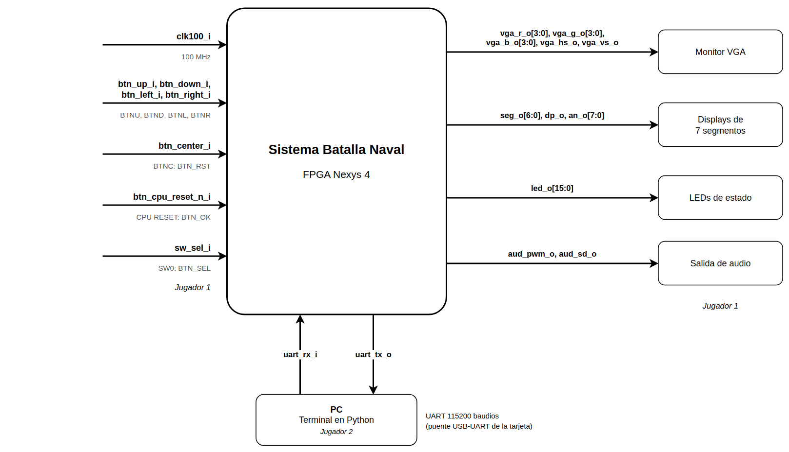
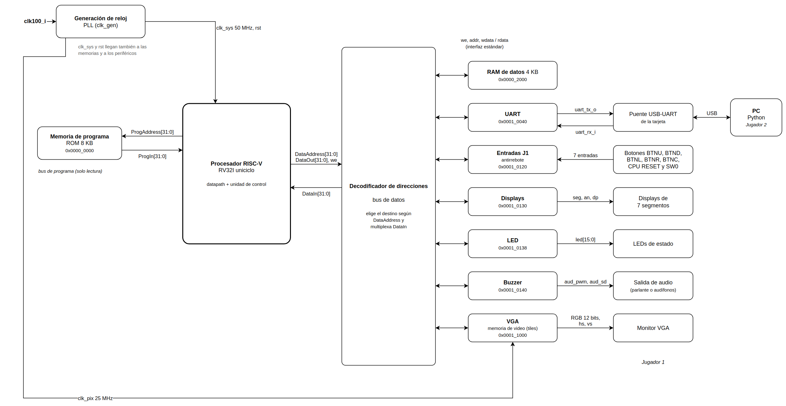

# EL3313 – Taller de Diseño Digital

# Proyecto 3 – Batalla Naval sobre un microprocesador RISC‑V con periférico VGA

## Planteamiento del diseño – Primer avance

**Curso:** EL3313 Taller de Diseño Digital

**Semestre:** II Semestre 2026

**Proyecto:** Proyecto 3 – Batalla Naval

**Integrantes:** Mariana Fallas Fallas, Abner López Méndez, Justin Garita Serrano, Jordi Segura Chinchilla

---

# Tabla de contenido

1. Introducción
2. Objetivos
3. Alcance del primer avance
4. Metodología de diseño
5. Arquitectura general del sistema
6. Diagrama de primer nivel
7. Diagrama de segundo nivel
8. Definición de módulos
9. Interfaces principales
10. Estrategia de implementación
11. Organización del trabajo
12. Estrategia de validación
13. Siguiente avance
14. Conclusiones

---

# 1. Introducción

El Proyecto 3 consiste en desarrollar una plataforma embebida sobre una FPGA que ejecuta un juego de Batalla Naval utilizando un microprocesador RISC‑V diseñado por el equipo. A diferencia de proyectos anteriores, la lógica principal del juego no se implementa mediante máquinas de estado dedicadas en hardware, sino mediante un programa en lenguaje ensamblador que se ejecuta sobre el procesador.

La plataforma integra memorias de programa y datos, periféricos mapeados en memoria, un controlador VGA para el Jugador 1, un periférico UART para la comunicación con una aplicación de PC correspondiente al Jugador 2, además de indicadores locales como LEDs, displays de siete segmentos y salida de sonido.

El propósito de este primer avance es establecer la arquitectura modular del sistema y definir cómo se dividirá el desarrollo del proyecto durante las siguientes etapas.

---

# 2. Objetivos

## Objetivo general

Diseñar la arquitectura modular del sistema Batalla Naval identificando sus bloques principales, interfaces y estrategia de implementación utilizando una metodología Top‑Down.

## Objetivos específicos

- Definir el sistema completo mediante un diagrama de primer nivel.
- Descomponer la FPGA en módulos funcionales mediante un diagrama de segundo nivel.
- Identificar las interfaces principales entre procesador, memorias y periféricos.
- Definir una estrategia de desarrollo e integración del proyecto y la división del trabajo en el equipo.
- Establecer un plan de validación para cada módulo.

---

# 3. Alcance del primer avance

Este documento únicamente contempla el planteamiento del diseño. No incluye la implementación del procesador ni de los periféricos, sino la propuesta de organización del sistema y la planificación del desarrollo.

Los siguientes elementos forman parte de este avance:

- Arquitectura de primer nivel.
- Arquitectura de segundo nivel.
- Descripción funcional de cada módulo.
- Interfaces principales del sistema.
- Organización del trabajo en el equipo.
- Estrategia inicial de validación.

---

# 4. Metodología de diseño

Se utilizará la metodología de diseño modular vista en el curso, con enfoque Top‑Down.

La idea consiste en comenzar con la arquitectura completa del sistema y posteriormente dividirla en módulos independientes. Para cada bloque se definen su objetivo, entradas, salidas y funcionamiento general. Cada módulo será implementado y validado individualmente antes de integrarlo con el resto de la plataforma.

## Ventajas del enfoque

- Desarrollo modular.
- Simulación independiente de bloques.
- Integración progresiva.
- Reutilización de módulos (por ejemplo, el UART del Proyecto 2).
- Facilita la documentación técnica y la división del trabajo.

---

# 5. Arquitectura general del sistema

El sistema se divide en dos actores principales.

## Jugador 1

Interactúa directamente con la FPGA mediante:

- Botones y un switch.
- Monitor VGA.
- LEDs.
- Displays de siete segmentos.
- Salida de sonido.

## Jugador 2

Interactúa mediante una aplicación desarrollada en Python que se comunica con la FPGA a través del periférico UART.

El microprocesador RISC‑V ejecuta toda la lógica del juego y controla los periféricos mediante memoria mapeada: cada periférico ocupa un rango de direcciones y el procesador lo maneja con instrucciones `lw` y `sw`. Los periféricos solo realizan entrada y salida; no contienen reglas del juego.

---

# 6. Diagrama de primer nivel

**Figura 1.** Diagrama de primer nivel del sistema.

## Objetivo

Representar el sistema completo y todas sus interfaces externas.

## Descripción

El sistema se implementa dentro de una FPGA Nexys 4 y recibe entradas físicas del Jugador 1. Las salidas locales permiten visualizar y seguir la partida. El Jugador 2 se comunica mediante UART utilizando una aplicación ejecutada en una computadora.

## Entradas

| Señal | Pin de la tarjeta | Descripción |
|-------|-------------------|-------------|
| `clk100_i` | Oscilador | Reloj principal de 100 MHz. |
| `btn_up_i`, `btn_down_i`, `btn_left_i`, `btn_right_i` | BTNU, BTND, BTNL, BTNR | Navegación del cursor. |
| `btn_center_i` | BTNC | `BTN_RST`: nueva partida, conservando las victorias. |
| `btn_cpu_reset_n_i` | Botón CPU RESET (activo en bajo) | `BTN_OK`: confirmar colocación o disparo. |
| `sw_sel_i` | Switch SW0 | `BTN_SEL`: rotar el barco. |
| `uart_rx_i` | Puente USB‑UART | Datos recibidos desde la PC. |

La Nexys 4 tiene cinco pulsadores más el botón CPU RESET. Como el enunciado fija `BTN_RST` en el botón central y la navegación usa los otros cuatro, `BTN_OK` se asigna al botón CPU RESET y `BTN_SEL` a un switch.

## Salidas

| Señal | Destino | Descripción |
|-------|---------|-------------|
| `vga_r_o[3:0]`, `vga_g_o[3:0]`, `vga_b_o[3:0]`, `vga_hs_o`, `vga_vs_o` | Monitor VGA | Video para el Jugador 1. |
| `seg_o[6:0]`, `dp_o`, `an_o[7:0]` | Displays de 7 segmentos | Contador de partidas ganadas. |
| `led_o[15:0]` | LEDs | Fase del juego. |
| `aud_pwm_o`, `aud_sd_o` | Salida de audio | Retroalimentación sonora. |
| `uart_tx_o` | Puente USB‑UART | Datos enviados a la PC. |

## Descripción funcional

El sistema recibe las acciones del Jugador 1 por los botones y las del Jugador 2 por el UART. Con esta información ejecuta la lógica del juego y muestra a cada jugador el estado de la partida por su propia interfaz, sin revelarle los barcos no descubiertos del rival.

---

# 7. Diagrama de segundo nivel

**Figura 2.** Diagrama de segundo nivel del sistema.

## Objetivo

Descomponer la plataforma FPGA en módulos independientes.

## Organización propuesta

- Generación de reloj (PLL).
- Núcleo RISC‑V (RV32I).
- Memoria de programa (ROM).
- Memoria de datos (RAM).
- Decodificador de direcciones (bus de datos).
- Periférico de entradas del Jugador 1.
- Periférico UART.
- Periférico VGA.
- Periférico de displays.
- Periférico de LEDs.
- Periférico de sonido (buzzer).

## Flujo de información

- La ROM únicamente entrega instrucciones al procesador, por un bus de programa independiente (solo lectura).
- La RAM y todos los periféricos comparten un único bus de datos. El decodificador de direcciones revisa la dirección de cada acceso y lo dirige a la RAM o al periférico correspondiente.
- El PLL genera el reloj del sistema para el procesador, las memorias y los periféricos, y el reloj de píxel para el VGA.

---

# 8. Definición de módulos

## 8.1 Generación de reloj (PLL)

### Objetivo

Obtener los relojes que necesita el sistema a partir del reloj de la tarjeta.

### Entradas

- `clk100_i` (100 MHz).

### Salidas

- `clk_sys`: reloj del sistema para el procesador, las memorias y los periféricos.
- `clk_pix`: reloj de píxel de 25 MHz para el VGA.
- Reinicio general: activo mientras el PLL no se estabiliza, al programar o encender la tarjeta.

`BTN_RST` no reinicia el hardware: lo lee el programa y comienza una nueva partida, conservando los contadores de victorias.

---

## 8.2 Microprocesador RISC‑V

### Objetivo

Ejecutar el programa del juego y controlar todos los periféricos.

### Función

- Ejecutar las instrucciones RV32I requeridas por el enunciado.
- Leer instrucciones desde la ROM.
- Leer y escribir la RAM y los periféricos mediante memoria mapeada.

### Entradas

- `clk_i`, `rst_i` (desde el bloque de reloj).
- `ProgIn_i[31:0]`: instrucción leída de la ROM.
- `DataIn_i[31:0]`: dato leído de la RAM o de un periférico.

### Salidas

- `ProgAddress_o[31:0]`: dirección de la instrucción.
- `DataAddress_o[31:0]`: dirección del acceso de datos.
- `DataOut_o[31:0]`: dato a escribir.
- `we_o`: habilitación de escritura.

---

## 8.3 Memoria de programa (ROM)

### Objetivo

Almacenar el programa del juego.

### Función

Contiene únicamente las instrucciones del programa en ensamblador. Ocupa el rango `0x0000_0000–0x0000_1FFF`; la ejecución inicia en `0x0000_0000`.

### Interfaz

| Señal | Dirección |
|-------|-----------|
| `ProgAddress_o` | CPU → ROM |
| `ProgIn_i` | ROM → CPU |

---

## 8.4 Memoria de datos (RAM)

### Objetivo

Almacenar los datos del juego.

### Información almacenada

- Tablero del Jugador 1.
- Tablero del Jugador 2.
- Turno activo.
- Estado de los barcos.
- Contadores.
- Variables auxiliares y pila.

Ocupa el rango `0x0000_2000–0x0000_2FFF`.

### Interfaz

Se conecta al procesador a través del decodificador de direcciones.

| Señal | Dirección |
|-------|-----------|
| Dirección, dato de escritura y `we` | CPU → decodificador → RAM |
| Dato leído | RAM → decodificador → CPU |

---

## 8.5 Decodificador de direcciones (bus de datos)

### Objetivo

Conectar el procesador con la RAM y todos los periféricos.

### Función

Compara los bits altos de `DataAddress_o`, activa la escritura solo del destino seleccionado y elige el dato que vuelve al procesador por `DataIn_i`.

### Mapa de memoria

| Destino | Dirección |
|---------|-----------|
| RAM | `0x0000_2000–0x0000_2FFF` |
| UART | `0x0001_0040` (Control/Estado), `0x0001_0044` (TX), `0x0001_0048` (RX) |
| Entradas del Jugador 1 | `0x0001_0120` |
| Displays | `0x0001_0130` |
| LEDs | `0x0001_0138` |
| Buzzer | `0x0001_0140` |
| Memoria de video (VGA) | `0x0001_1000–0x0001_17FF` |

### Señales

- Desde el procesador: `DataAddress_o`, `DataOut_o`, `we_o`.
- Hacia el procesador: `DataIn_i`.
- Hacia cada periférico: su habilitación de escritura, su dirección interna y el dato de escritura; desde cada periférico, su dato leído.

---

## 8.6 Interfaz común de los periféricos

Los periféricos de registros (entradas, UART, displays, LEDs y buzzer) usan la interfaz estándar del enunciado:

| Señal | Descripción |
|-------|-------------|
| `clk_i`, `rst_i` | Reloj y reinicio del sistema. |
| `write_enable_i` | Escritura en el registro seleccionado. |
| `addr_i[1:0]` | Selección de uno de hasta cuatro registros internos. |
| `wdata_i[31:0]` | Dato de escritura. |
| `rdata_o[31:0]` | Dato leído. |

El VGA usa las mismas señales, pero con una dirección más ancha, porque se comporta como una memoria.

---

## 8.7 Periférico de entradas del Jugador 1

### Objetivo

Leer las entradas del Jugador 1.

### Funciones

- Sincronización y eliminación de rebotes (*debouncing*).
- Entrega del estado de cada entrada al procesador en un registro.

### Entradas

- Interfaz común de periféricos.
- `btn_up_i`, `btn_down_i`, `btn_left_i`, `btn_right_i`, `btn_center_i`, `btn_cpu_reset_n_i`, `sw_sel_i`.

### Salida

- `rdata_o`: registro de estado con un bit por entrada.

---

## 8.8 Periférico UART

### Objetivo

Comunicación serial con la aplicación de PC a 115200 baudios. Se reutiliza el periférico del Proyecto 2.

### Funciones

- Transmitir mensajes.
- Recibir comandos.
- Acceso mediante registros.

### Registros

- Control/Estado.
- Datos TX.
- Datos RX.

### Entradas y salidas

- Interfaz común de periféricos.
- `uart_rx_i` (entrada) y `uart_tx_o` (salida) hacia el puente USB‑UART de la tarjeta.

---

## 8.9 Periférico VGA

### Objetivo

Generar la imagen del Jugador 1 a 640 × 480 y 60 Hz.

### Funciones

- Sincronismos VGA.
- Lectura de la memoria de video.
- Generación del color de cada píxel.

### Memoria de video

Mapa de *tiles* donde cada palabra representa un bloque de la pantalla. El procesador actualiza un bloque con una sola escritura y no dibuja píxel por píxel. La memoria es de doble puerto: un puerto para el procesador, con el reloj del sistema, y otro de solo lectura para la generación de video, con el reloj de píxel.

### Entradas y salidas

- Interfaz común de periféricos, con dirección de memoria de video.
- `clk_pix` (25 MHz).
- `vga_r_o[3:0]`, `vga_g_o[3:0]`, `vga_b_o[3:0]`, `vga_hs_o`, `vga_vs_o` hacia el monitor.

---

## 8.10 Displays de siete segmentos

### Objetivo

Mostrar el contador acumulado de partidas ganadas.

### Función

Dos dígitos para el Jugador 1 y dos para el Jugador 2, multiplexados.

### Entradas y salidas

- Interfaz común de periféricos.
- `seg_o[6:0]`, `dp_o`, `an_o[7:0]` hacia los displays.

---

## 8.11 LEDs

### Objetivo

Mostrar la fase del juego.

### Estados

- Colocación.
- Batalla.
- Resultado final.

### Entradas y salidas

- Interfaz común de periféricos.
- `led_o[15:0]` hacia los LEDs.

---

## 8.12 Buzzer

### Objetivo

Generar retroalimentación sonora. La Nexys 4 no trae un zumbador, por lo que el sonido sale por la salida de audio PWM de la tarjeta.

### Eventos

- Impacto.
- Fallo.
- Hundimiento.
- Colocación inválida.
- Victoria.

### Entradas y salidas

- Interfaz común de periféricos.
- `aud_pwm_o`, `aud_sd_o` hacia la salida de audio.

---

# 9. Interfaces principales

## Procesador ↔ ROM (bus de programa)

| Señal | Tamaño |
|-------|--------|
| `ProgAddress_o` | 32 bits |
| `ProgIn_i` | 32 bits |

## Procesador ↔ decodificador de direcciones (bus de datos)

| Señal | Tamaño |
|-------|--------|
| `DataAddress_o` | 32 bits |
| `DataOut_o` | 32 bits |
| `DataIn_i` | 32 bits |
| `we_o` | 1 bit |

Por este bus el procesador accede a la RAM y a todos los periféricos:

- **UART:** lee y escribe los registros Control/Estado, TX y RX. Las patas `uart_tx_o` y `uart_rx_i` van del periférico a la PC, no al procesador.
- **Entradas del Jugador 1:** lee el registro de estado de los botones.
- **VGA:** escribe la memoria de video.
- **Displays, LEDs y buzzer:** escribe sus registros.

---

# 10. Estrategia de implementación

## Etapa 1

Arquitectura y documentación.

**Productos**

- Diagramas.
- Interfaces.
- Planeamiento.

## Etapa 2

Procesador.

**Módulos**

- ALU.
- Banco de registros.
- Generador de inmediatos.
- Unidad de control.
- Datapath.

## Etapa 3

Memorias, bus de datos y reloj.

- ROM.
- RAM.
- Decodificador de direcciones.
- PLL.

## Etapa 4

Periféricos.

- Entradas del Jugador 1.
- UART (reutilizado del Proyecto 2).
- Displays.
- LEDs.
- Buzzer.

## Etapa 5

Periférico VGA.

- Sincronismos.
- Memoria de video.
- Generación de color.

## Etapa 6

Programa en ensamblador.

- Inicialización.
- Colocación.
- Batalla.
- Final.

## Etapa 7

Aplicación de PC.

- Comunicación UART.
- Interfaz del Jugador 2.

## Etapa 8

Integración completa.

- Hardware.
- Software.
- Simulación.
- FPGA.

---

# 11. Organización del trabajo

## División de tareas

Cada integrante tiene a cargo un bloque de hardware y la parte del programa en ensamblador más relacionada con ese bloque.

| Integrante | Módulos | Ensamblador | Revisa los PR de |
|------------|---------|-------------|------------------|
| Mariana Fallas | Procesador RISC‑V | Fase de batalla y fin de partida | Jordi |
| Abner López | Periférico VGA | Pantalla y colocación del Jugador 1 | Justin |
| Justin Garita | UART y aplicación de PC | Comunicación UART y colocación del Jugador 2 | Abner |
| Jordi Segura | Memorias, decodificador, PLL, entradas, displays, LEDs, buzzer e integración | Inicialización, lazo principal y reinicio de partida | Mariana |

La documentación (planteamiento e informe) es compartida: cada integrante redacta la parte de sus módulos.

## Flujo de trabajo en el repositorio

- `main`: versiones estables.
- `develop`: rama de integración.
- `feature/<módulo>`: una rama por funcionalidad, que se integra a `develop` mediante *pull request* revisado por otro integrante.
- Cada tarea se registra como *issue* asignado a un integrante.

## Orden de trabajo

| Etapa | Actividades |
|-------|-------------|
| Primera | Arquitectura, diagramas, procesador base y memorias. |
| Segunda | Periféricos: entradas, UART, displays, LEDs, buzzer y VGA. |
| Tercera | Programa en ensamblador, aplicación Python, integración y pruebas. |

---

# 12. Estrategia de validación

## Validación por módulo

Cada módulo tendrá un testbench autoverificable que indique PASS o FAIL en cada prueba.

| Módulo | Estrategia |
|--------|------------|
| Procesador | Programa de prueba que ejecuta cada instrucción RV32I requerida y compara resultados. |
| ROM | Lectura de instrucciones. |
| RAM y decodificador | Lectura y escritura en cada región del mapa de memoria. |
| UART | Transmisión y recepción. |
| Entradas | Eliminación de rebotes. |
| VGA | Temporización de sincronismos y memoria de video. |
| Displays | Multiplexado. |
| LEDs | Estados del juego. |
| Buzzer | Frecuencia y duración de cada evento. |

## Validación de integración

- Comunicación UART con la aplicación de PC.
- Actualización de la pantalla VGA.
- Estados del juego.
- Integración de memorias y periféricos.
- Simulación post-implementación temporizada de un fragmento del programa y de la validación de un disparo, como exige el enunciado.
- Pruebas sobre la FPGA.

---

# 13. Siguiente avance

El siguiente avance desarrollará:

- Diagrama de tercer nivel de cada módulo.
- Organización de los datos del juego en la RAM.
- Distribución de la pantalla en *tiles* y formato de la memoria de video.
- Protocolo de mensajes entre la FPGA y la aplicación de PC.

---

# 14. Conclusiones

El planteamiento del diseño define una arquitectura modular para el Proyecto 3 basada en una metodología Top‑Down. La separación entre procesador, memorias y periféricos, conectados por un bus de datos con decodificador de direcciones, permitirá implementar y validar cada bloque de forma independiente antes de integrarlo en el sistema completo. La división del trabajo por módulos y el uso de ramas con revisión entre integrantes ordenan el desarrollo del equipo. Este documento constituye la base para las siguientes etapas del proyecto y para la documentación técnica final.
