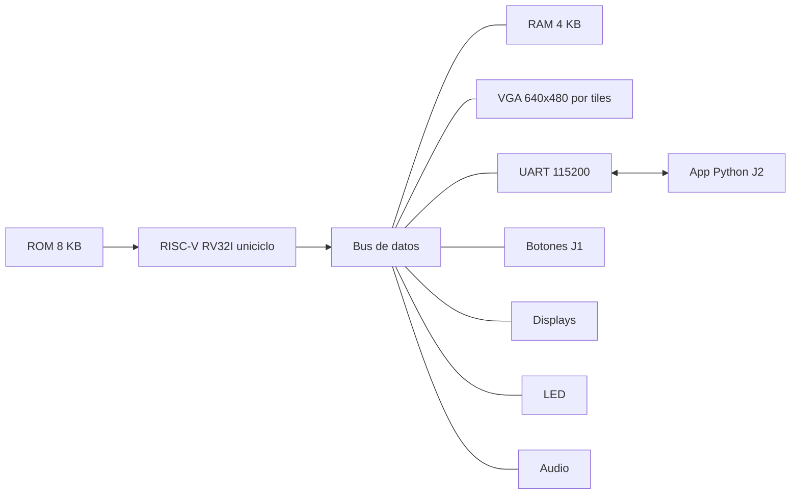

# Batalla Naval sobre RISC-V con periférico VGA

Proyecto 3 — EL3313 Taller de Diseño Digital, Instituto Tecnológico de Costa Rica.

Juego de Batalla Naval para dos jugadores. Todo el control del juego es un programa en ensamblador que corre sobre un **microprocesador RV32I uniciclo diseñado por el equipo**, implementado en una FPGA Nexys 4 junto con sus memorias y periféricos mapeados en memoria.

- **Jugador 1:** juega en la tarjeta, con un monitor VGA, botones, displays de 7 segmentos, LED y sonido.
- **Jugador 2:** juega desde una aplicación de consola en Python conectada por UART a 115200 baudios.



## Estructura del repositorio

```
Batalla_Naval_RISC-V_FPGA_PC_UART_VGA/
├── FPGA/
│   ├── DESIGN/          RTL en SystemVerilog (y núcleo UART en VHDL), programa.mem
│   ├── SIMULATION/      Testbenches autoverificables y programas de prueba (programas/)
│   ├── CONSTRAINTS/     nexys4_batalla_naval.xdc
│   └── DOCUMENTATION/   Procesador, memorias y bus, periféricos locales, UART, VGA, sistema
├── ASSEMBLY/
│   ├── DESIGN/          batalla_naval.s (programa del juego)
│   ├── SIMULATION/      Simulador de instrucciones y prueba de partidas completas
│   └── DOCUMENTATION/   Estructura del programa, RAM, rutinas y validación
├── PYTHON/
│   ├── DESIGN/          jugador2.py, cliente.py, protocolo.py
│   ├── SIMULATION/      Prueba de la aplicación contra el programa de la FPGA
│   └── DOCUMENTATION/   Uso, estructura y validación de la aplicación
└── docs/
    ├── diseño/          planteamiento.md (planteamiento del diseño)
    └── informe/         informe.md (informe técnico)
```

## Dependencias

| Para | Herramienta |
|---|---|
| Síntesis, implementación y simulación | Xilinx Vivado |
| Tarjeta | Digilent Nexys 4 (Artix-7), monitor VGA, audífonos o parlante en la salida de audio |
| Ensamblar el programa | RARS 1.6 (Java) |
| Aplicación del Jugador 2 | Python 3 y pyserial (`pip install pyserial`) |
| Pruebas del programa y de la aplicación | Python 3 (Pillow, opcional, para generar imágenes de la pantalla) |

## Compilación

### 1. Programa del juego

1. Abrir `ASSEMBLY/DESIGN/batalla_naval.s` en RARS.
2. En *Settings → Memory Configuration*, elegir **Compact, Text at Address 0**.
3. Ensamblar y exportar con *File → Dump Memory*: segmento `.text`, formato *Hexadecimal Text*.
4. Guardar como `FPGA/DESIGN/programa.mem`.

Desde la línea de comandos:

```
java -jar rars1_6.jar a nc mc CompactTextAtZero dump .text HexText FPGA/DESIGN/programa.mem ASSEMBLY/DESIGN/batalla_naval.s
```

### 2. Hardware

1. Crear un proyecto de Vivado para la Nexys 4 (`xc7a100tcsg324-1`).
2. Agregar como *Design Sources* todo `FPGA/DESIGN/`: los `.sv`, `UART_tx.vhd`, `UART_rx.vhd` y `programa.mem`.
3. Agregar como *Constraints* `FPGA/CONSTRAINTS/nexys4_batalla_naval.xdc`.
4. Poner `top` como módulo superior.
5. Ejecutar *Generate Bitstream* y programar la tarjeta.

## Simulación

| Qué | Cómo |
|---|---|
| Módulos de hardware | En Vivado, agregar el testbench de `FPGA/SIMULATION/` como *Simulation Source*, ponerlo como top y ejecutar *Run Behavioral Simulation*. Cada testbench imprime PASS/FAIL por prueba y `RESULTADO: PASS` al final |
| Sistema con programa de prueba | `tb_top.sv`; agregar `programas/tb_top.mem` como fuente de simulación |
| Sistema con el juego | `tb_sistema_juego.sv`; agregar `FPGA/DESIGN/programa.mem` como fuente de simulación |
| Programa del juego | `cd ASSEMBLY/SIMULATION` y `python3 prueba_juego.py ../../FPGA/DESIGN/programa.mem` |
| Aplicación de PC | `cd PYTHON/SIMULATION` y `python3 prueba_app.py ../../FPGA/DESIGN/programa.mem` |

## Ejecución

1. Programar la tarjeta y conectar el monitor VGA y los audífonos o parlante.
2. En la PC del Jugador 2:
   ```
   cd PYTHON/DESIGN
   python jugador2.py           (lista los puertos)
   python jugador2.py COM5      (puerto de la Nexys 4)
   ```
3. Presionar `BTN_RST` (botón central) para empezar una partida.

Controles del Jugador 1:

| Control | Acción |
|---|---|
| BTNU, BTND, BTNL, BTNR | Mover el cursor |
| Switch SW0 | Rotar el barco (cada cambio de posición) |
| Botón CPU RESET | `BTN_OK`: confirmar colocación o disparo |
| BTNC | `BTN_RST`: nueva partida, conservando las victorias |

LED: LD0 colocación, LD1 batalla, LD2 resultado. Los displays muestran las victorias del J1 (izquierda) y del J2 (derecha).

## Flujo de trabajo

- `main`: versiones estables.
- `develop`: integración.
- `feature/<funcionalidad>`: una rama por funcionalidad, integrada a `develop` mediante pull request revisado.
- Cada tarea tiene un *issue* asignado a un integrante.

## Integrantes

*Pendiente.*

## Referencias

- D. Harris y S. Harris. *Digital Design and Computer Architecture. RISC-V Edition*. Morgan Kaufmann, 2022.
- P. P. Chu. *FPGA Prototyping by SystemVerilog Examples*. Wiley, 2018.
